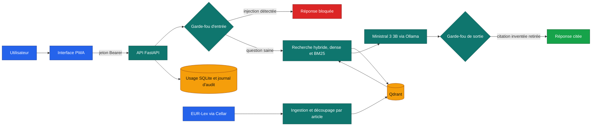

# Vigie

<!-- adam-badges:start -->
[](https://github.com/Adam-Blf/vigie/commits)
[](https://hits.sh/github.com/Adam-Blf/vigie/)
[](https://github.com/Adam-Blf/vigie/commits)
[](https://github.com/Adam-Blf/vigie)
[](LICENSE)
[](https://github.com/Adam-Blf/vigie/actions/workflows/ci.yml)
[](CHANGELOG.md)
[](https://github.com/Adam-Blf/vigie/releases)
[](pyproject.toml)
[](docs/adr)
[](deploy/k8s)
<!-- adam-badges:end -->

Version 0.1.0 - en construction, suivi jalon par jalon dans [docs/progress.md](docs/progress.md)

Copilote de conformité pour les banques. Vigie répond aux questions sur DORA, l'AI Act, le
RGPD et le règlement anti-blanchiment en citant l'article exact, dit quand il ne trouve
rien dans les textes, et bloque les tentatives de manipulation. Une nouvelle version ne
part en production que si elle passe l'évaluation.

Projet réalisé dans le cadre du cours MLOps, M2 Data Engineering et IA, EFREI Paris.
Projet pédagogique, non affilié officiellement à l'EFREI.

## Architecture



Chaque bloc correspond à un module de `src/vigie/`, avec une seule responsabilité par
module. Le détail des composants, du budget mémoire et du chemin de livraison est dans
`docs/architecture.md`.

## Démarrage local

```sh
uv venv --python 3.12 .venv
uv pip install --python .venv -e ".[dev]"
python tasks.py check
```

Le lancement complet en une commande (`docker compose up`) arrive avec le jalon J7.

## Configuration

Toutes les variables d'environnement sont décrites et commentées dans `.env.example`. Elles
portent le préfixe `VIGIE_` et sont lues par `src/vigie/config.py`.

## Contribuer

Une branche par jalon, une pull request par branche, fusion par commit de merge une fois
la CI verte. Chaque commit crédite le binôme (auteur ou co-auteur).

## Auteurs

Adam Beloucif et Emilien Morice.
