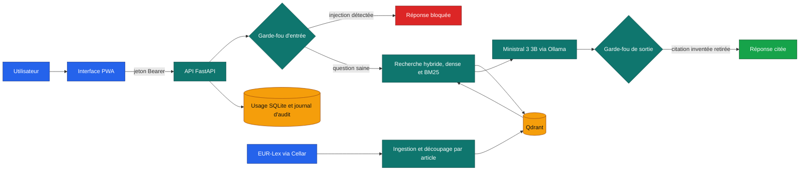

# Vigie

<p align="center">
<!-- adam-badges:start -->
<a href="https://github.com/Adam-Blf/vigie/releases"></a>
<a href="https://github.com/Adam-Blf/vigie/actions/workflows/ci.yml"></a>
<a href="https://github.com/Adam-Blf/vigie/commits"></a>
<a href="https://hits.sh/github.com/Adam-Blf/vigie/"></a>
<a href="https://github.com/Adam-Blf/vigie/commits"></a>
<a href="https://github.com/Adam-Blf/vigie"></a>
<a href="LICENSE"></a>
<!-- adam-badges:end -->
</p>

Version 0.7.0 - en construction, suivi jalon par jalon dans [docs/progress.md](docs/progress.md)

Copilote de conformité pour les banques. Vigie répond aux questions sur DORA, l'AI Act, le
RGPD et le règlement anti-blanchiment en citant l'article exact, dit quand il ne trouve
rien dans les textes, et bloque les tentatives de manipulation. Une nouvelle version ne
part en production que si elle passe l'évaluation.

Projet réalisé dans le cadre du cours MLOps, M2 Data Engineering et IA, EFREI Paris.
Le sujet a été proposé et rédigé par nous-mêmes, Adam Beloucif et Emilien Morice, puis
validé par l'enseignant le 2 octobre 2026. Projet pédagogique, publié avec l'accord de
l'enseignant, non affilié officiellement à l'EFREI.

## Architecture



Chaque bloc correspond à un module de `src/vigie/`, avec une seule responsabilité par
module. Le détail des composants, du budget mémoire et du chemin de livraison est dans
`docs/architecture.md`. Les risques OWASP LLM sont cartographiés dans
`docs/risk-map.md`, les menaces dans `docs/threat-model.md` et les choix structurants dans
`docs/adr/`.

## Démarrage local

```sh
uv venv --python 3.12 .venv
uv pip install --python .venv -e ".[dev]"
python tasks.py check
python tasks.py typo
```

`python tasks.py typo` refuse tirets longs, demi-cadratins, médiopoints et caractères
invisibles dans tous les fichiers suivis.

Le corpus réglementaire se construit avec `vigie-ingest`, qui télécharge les quatre textes
depuis Cellar, les vérifie contre `data/corpus.lock` et écrit un JSONL par règlement dans
`data/corpus/` (détail dans [docs/corpus.md](docs/corpus.md)).

Le jeu de référence (`data/golden/`, 80 questions vérifiées contre Cellar, partie `test`
scellée) se contrôle avec `vigie-eval`, qui sort en erreur au moindre écart. Il lit les
JSONL de `data/corpus/` par défaut, ou les XHTML Cellar que `vigie-ingest` garde dans
`data/cache/` :

```sh
vigie-eval validate-golden --corpus data/cache
```

Les seuils que l'évaluation devra tenir sont fixés d'avance dans `eval/thresholds.yaml`.

Une question se pose déjà au modèle sur un jeu de passages fixe, en attendant l'index
Qdrant :

```sh
python -m vigie.rag.cli --passages tests/fixtures/dora_art28_passages.json "Quelles vérifications avant de conclure avec un prestataire TIC ?"
```

La réponse s'affiche en flux, puis la réponse validée sort en JSON : toute citation qui ne
renvoie à aucun passage fourni en est retirée, et une réponse sans citation valide devient
un refus explicite. Le fournisseur se choisit avec `VIGIE_LLM_PROVIDER` (`ollama` par
défaut, `fake` pour les tests).

Le lancement complet en une commande (`docker compose up`) arrive avec le jalon J7.

## Configuration

Toutes les variables d'environnement sont décrites et commentées dans `.env.example`. Elles
portent le préfixe `VIGIE_` et sont lues par `src/vigie/config.py`.

## Contribuer

Une branche par jalon, une pull request par branche, fusion par commit de merge une fois
la CI verte. Chaque commit crédite le binôme (auteur ou co-auteur). Règles détaillées
dans `CONTRIBUTING.md`.

## Licence

Code propriétaire, tous droits réservés. Le dépôt est public pour consultation, toute
réutilisation demande un accord écrit des auteurs (voir `LICENSE`).

## Auteurs

Adam Beloucif et Emilien Morice.
