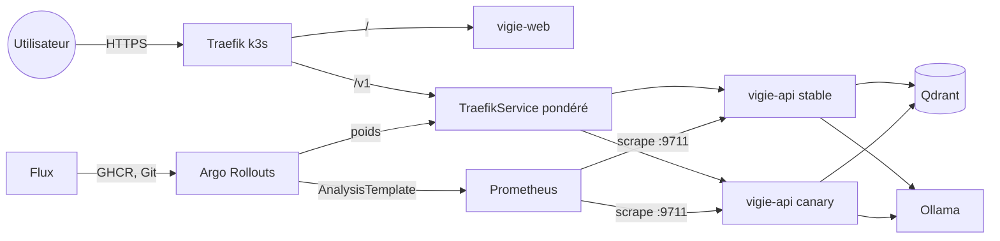

# Déploiement Kubernetes de Vigie

Manifestes kustomize pour le nœud unique Oracle Always Free (k3s, 2 OCPU, 12 Go) et
pour un cluster k3d local. Les versions épinglées sont dans `deploy/versions.env`.

## Organisation

| Dossier | Rôle | Appliqué par |
|---|---|---|
| `base/` | Namespace `vigie`, Qdrant, Ollama, MLflow, Prometheus, PWA, API en Argo Rollouts, NetworkPolicies, Job d'ingestion, CronJob de snapshot | les overlays |
| `overlays/dev` | k3d local, images `:dev`, faux LLM, Ollama à zéro réplica | à la main |
| `overlays/prod` | nœud Oracle, TLS Let's Encrypt (HTTP-01), HSTS, hôte public | Flux |
| `overlays/prod-loadtest` | prod avec le faux LLM, pour le test de charge | à la main, Flux suspendu |
| `system/` | Argo Rollouts v1.10.0 et Flux v2.9.6 réduit à quatre contrôleurs | une fois, par l'administrateur |
| `cd/` | source Git, synchronisation de `overlays/prod`, automatisation des images | une fois, par l'administrateur |



## Secrets attendus (jamais dans le dépôt)

| Namespace | Secret | Clés | Obligatoire |
|---|---|---|---|
| `vigie` | `vigie-secrets` | `qdrant-api-key` | oui |
| `vigie` | `vigie-backup` | `par-url` (URL pré-authentifiée du bucket Object Storage) | non |
| `flux-system` | `vigie-git` | `identity`, `identity.pub`, `known_hosts` (clé de déploiement en écriture) | pour Flux |

Création de la clé Qdrant sans l'afficher :

```sh
python -c "import secrets,sys; sys.stdout.write(secrets.token_urlsafe(32))" > /tmp/qk
kubectl -n vigie create secret generic vigie-secrets --from-file=qdrant-api-key=/tmp/qk
rm /tmp/qk
```

## Valider sans cluster

```sh
python tasks.py k8s-validate
```

La tâche rend chaque couche avec `kustomize`, la valide avec `kubeconform` (schémas
Kubernetes 1.35 et catalogue de CRD épinglé), puis lance `python -m vigie.deploy` sur
`overlays/prod` et `system` réunis. Ce dernier contrôle refuse :

- une somme des `requests` mémoire au-dessus de 8,5 Gio, ou des `limits` au-dessus de
  10,5 Gio, réserve de k3s comprise (section 11.7 du brief) ;
- une somme des `requests` CPU au-dessus de 1,8 cœur ;
- dans le namespace `vigie`, un pod sans `runAsNonRoot`, `readOnlyRootFilesystem`,
  `drop: [ALL]`, seccomp `RuntimeDefault` ou avec le jeton de compte de service monté ;
- une image sans tag, sans digest ou en `latest`.

L'API compte pour quatre pods : le plafond du HPA (3) plus le pod canary fixé par
`setCanaryScale`. `kustomize` et `kubeconform` se téléchargent dans un dossier
temporaire, jamais dans le dépôt.

## Cluster local k3d

```sh
k3d cluster create vigie-dev --image rancher/k3s:v1.35.5-k3s1 \
  --api-port 127.0.0.1:6550 -p "127.0.0.1:4780:80@loadbalancer"
kubectl apply --server-side -f build/k8s/system.yaml
kubectl apply --server-side -f build/k8s/overlays-dev.yaml
```

Avec le magasin d'images containerd de Docker Desktop, `k3d image import` annonce un
succès sans rien importer. Dans ce cas, passer par `ctr` :

```sh
docker save --platform linux/amd64 ghcr.io/adam-blf/vigie-web:dev -o web.tar
docker cp web.tar k3d-vigie-dev-server-0:/tmp/web.tar
docker exec k3d-vigie-dev-server-0 ctr -n k8s.io images import /tmp/web.tar
```

L'interface répond ensuite sur `http://127.0.0.1:4780/`. Les ports internes restent
privés ; on y accède par `kubectl port-forward` sur les ports locaux du projet :
Qdrant `6733:6333`, MLflow `5710:5000`, Prometheus `9710:9090`.

## Canary

Étapes du Rollout `vigie-api` : un pod canary, 10 % du trafic, pause de 45 s, analyse,
50 %, pause de 45 s, analyse, 100 %. L'`AnalysisTemplate` `vigie-canary` interroge
Prometheus toutes les 15 s, quatre fois, après 30 s d'attente :

- taux d'erreurs 5xx du canary sous 1 %, erreurs du LLM (`vigie_llm_errors_total`)
  retirées ;
- p95 de `/v1/ask` sous 1,5 fois celui des pods stables ;
- taux de blocage sous 3 fois celui des pods stables (référence plancher de 1 %).

Une mesure tirée de moins de 30 requêtes revient vide, donc « non concluante », jamais
réussie. Un échec annule le Rollout et renvoie tout le trafic vers les pods stables.
Un changement du bundle (`base/config/bundle.env`, ou une fusion dans un overlay)
change le hash de la ConfigMap générée et déclenche un canary sans nouvelle image.

## Livraison continue tirée

Flux tourne dans k3s : rien hors du cluster ne détient de kubeconfig et le port 6443
n'est jamais ouvert. Les `ImagePolicy` ne retiennent que les tags
`main-<sha>-<horodatage unix>`, le seul format triable ; la CI doit donc pousser ce tag
en plus du tag `<sha>`. Flux réécrit les tags marqués `$imagepolicy` de
`overlays/prod/kustomization.yaml` et pousse sur la branche `flux/image-updates`,
jamais sur `main`.

## Test de charge en production

```sh
flux suspend kustomization vigie-prod
kubectl apply --server-side -f build/k8s/overlays-prod-loadtest.yaml
# ... test de charge, 8 utilisateurs au plus ...
flux resume kustomization vigie-prod
```

La reprise de Flux réapplique `overlays/prod` et ramène le bundle `champion`.
