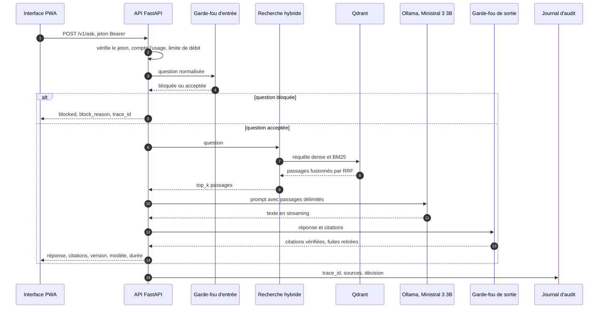
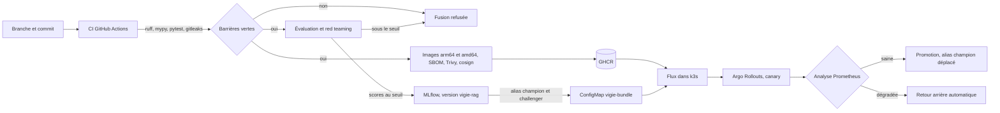

# Architecture de Vigie

Vigie répond aux questions d'une équipe conformité sur DORA, l'AI Act, le RGPD et le
règlement anti-blanchiment, en citant l'article exact. Ce document décrit le chemin d'une
question, le chemin d'une nouvelle version jusqu'à la production, les composants, le rôle
de chaque module Python et le budget mémoire qui arbitre l'ensemble.

Les choix d'hébergement et de modèle sont justifiés dans les ADR 0001 à 0003. Les risques
et leur traitement sont dans `docs/risk-map.md` et `docs/threat-model.md`.

## Chemin d'une requête

1. L'interface envoie la question avec un jeton Bearer.
2. L'API vérifie le jeton, compte l'usage et applique la limite de débit.
3. Le garde-fou d'entrée bloque l'injection, le jailbreak et la fuite de prompt.
4. La recherche hybride combine embeddings denses multilingues et BM25, fusionnés par RRF
   dans Qdrant.
5. Le LLM répond uniquement à partir des passages, avec des citations de la forme
   `[DORA art. 28 §1]`.
6. Le garde-fou de sortie retire les citations inventées et les fuites de données.
7. L'API renvoie la réponse, les sources et un identifiant de trace, puis écrit le
   journal d'audit.

## Chemin de livraison

Une nouvelle version n'atteint la production que si elle passe l'évaluation, puis le
canary. Le cluster tire lui-même les mises à jour : aucun accès au cluster n'est stocké
dans GitHub.

## Composants

| Composant | Rôle | Technologie | Exposition |
|---|---|---|---|
| Interface | chat, panneau de citations, réglages, usage | PWA Vite et TypeScript, servie par nginx | publique, derrière TLS |
| API | authentification, usage, garde-fous, orchestration RAG, audit, métriques | FastAPI, uvicorn | publique sous `/v1`, derrière TLS |
| Garde-fous | filtrage en entrée et en sortie | regex, classifieur ONNX int8, retenu par le benchmark J4 | interne |
| Recherche | embeddings denses et creux, fusion RRF | fastembed, Qdrant | interne |
| Base vectorielle | stockage des passages et des vecteurs | Qdrant, clé d'API | interne |
| LLM | rédaction de la réponse citée | Ollama, `ministral-3:3b-instruct-2512-q4_K_M` | interne |
| Suivi des modèles | versions, scores, alias | MLflow, backend SQLite | interne, `port-forward` seulement |
| Métriques | taux d'erreur, latence, taux de blocage par version | Prometheus | interne |
| Orchestration | pods, scaling, canary | k3s, Argo Rollouts, Flux, Traefik | Traefik seul exposé |
| Infrastructure | VM, réseau, sauvegardes, budget | Terraform, Oracle Cloud Always Free | SSH par clé, IP d'administration |

Ports locaux réservés à Vigie, tous liés à `127.0.0.1` : API 8710, interface 4710,
Qdrant 6733 et 6734, MLflow 5710, Prometheus 9710.

## Carte des modules

Chaque sous-paquet a une seule responsabilité. Un module qui en prend une seconde est
découpé.

| Module | Responsabilité unique |
|---|---|
| `vigie.config` | lire toute la configuration depuis l'environnement (`VIGIE_*`), avec un seul jeu de valeurs par défaut |
| `vigie.corpus` | télécharger les textes depuis Cellar, vérifier leurs empreintes, parser le XHTML et découper par article |
| `vigie.retrieval` | calculer les embeddings, alimenter la collection Qdrant et exécuter la recherche hybride |
| `vigie.llm` | exposer une interface commune aux fournisseurs de LLM (Ollama, faux LLM, Mistral pour comparaison) |
| `vigie.rag` | construire le prompt, enchaîner recherche et génération, valider les citations |
| `vigie.guard` | appliquer en production les garde-fous d'entrée et de sortie retenus par le benchmark |
| `vigie.api` | servir HTTP : application, authentification, usage, audit, schémas, métriques |
| `vigie.drift` | détecter la dérive des questions entrantes par rapport au jeu de référence |
| `vigie.evaluation` | évaluer une version sur le jeu de référence et journaliser les scores dans MLflow |
| `guardbench` | comparer plusieurs garde-fous sur un même jeu étiqueté, hors du chemin de production |

`guardbench` est volontairement séparé de `vigie` : le benchmark peut dépendre d'outils
lourds (torch, modèles de classification) qui ne doivent jamais entrer dans l'image de
production de l'API.

## Budget mémoire sur 12 Go

La VM Always Free offre 12 Go. 1,5 Go reste à l'OS. La somme des `requests` ne dépasse
pas 8,5 Go, celle des `limits` pas 10,5 Go. Estimations du brief (11.7) face aux
mesures du J7 (`docker stats --no-stream` sur la pile Compose remontée sur volumes vides le
7 octobre 2026, après deux questions ; Ollama mesuré le 6 octobre, modèle chargé ; preuves
dans [docs/proofs/J7/](proofs/J7/)) :

| Composant | Estimation | Mesuré au J7 | Verdict |
|---|---|---|---|
| k3s, Traefik, CoreDNS, metrics-server | 1,2 Go | hors Compose | à mesurer au J13 |
| Ollama avec Ministral 3B Q4 (une instance partagée) | 3,0 Go | 3,5 Gio (modèle chargé) | **dépasse** de 0,5 Go |
| Qdrant | 0,4 Go | 51 Mio (511 points) | dans le budget |
| MLflow (1 worker) | 0,4 Go | 426 Mio | **dépasse** de 26 Mio, sans expérience enregistrée |
| Prometheus (rétention 24 h) | 0,4 Go | hors Compose | à mesurer au J13 |
| Argo Rollouts, Flux | 0,2 Go | hors Compose | à mesurer au J13 |
| web | 0,05 Go | 3 Mio | dans le budget |
| API (par pod, sans torch) | 0,7 Go, 3 pods au plus | 975 Mio | **dépasse** de 0,27 Go par pod |
| **Total au pic** | **7,75 Go** | **8,7 Go** avec 3 pods d'API mesurés | au-dessus du plafond de 8,5 Go |

Le dépassement de l'API est mesuré, pas estimé : l'embedder dense chargé par fastembed
prend 558 Mio (le double de sa session ONNX brute), le classifieur des garde-fous
240 Mio, le reste est Python et les bibliothèques. Un seuil de restitution mémoire fixe
(`MALLOC_TRIM_THRESHOLD_`) a déjà rendu 270 Mio ; les autres réglages essayés n'ont rien
changé ([détail](proofs/J7/08-api-memory-by-model.txt)). La prochaine marche est de
brancher l'embedding int8 du J12 dans le retriever, ou une session ONNX directe pour la
branche dense ; d'ici là, la `limit` de 640 Mio du manifeste de l'API est trop basse et
le canary doit rester à 2 pods d'API au plus.

### Conteneurs Docker (J7)

| Image | Base épinglée par digest | Taille | Utilisateur | Écritures |
|---|---|---|---|---|
| `vigie-api` | `python:3.12-slim-bookworm` | amd64 1,51 Go, arm64 1,53 Go (559 Mo compressés ; modèles 483 Mo, venv 281 Mo) | 10001 | `/data` (volume), `/tmp` |
| `vigie-web` | `nginx-unprivileged:1.30-alpine` | amd64 85 Mo, arm64 24 Mo compressés | 101 | `/tmp`, `/var/cache/nginx` |

L'image de l'API ne contient ni torch ni uv ni les outils de préparation des modèles :
l'étape `models` du Dockerfile télécharge et quantifie sur la plateforme du builder (les
fichiers ONNX sont les mêmes pour amd64 et arm64), l'étape finale copie le résultat puis
recharge chaque modèle sans réseau sous l'utilisateur 10001 et sur l'architecture cible.
Les noms des modèles viennent de `config.py`, jamais du Dockerfile. Tous les conteneurs de
la pile tournent en `read_only`, sans capacité, avec `no-new-privileges`, sous un
utilisateur non root (API 10001, web 101, Qdrant, MLflow et Ollama 1000) ; seul le job
`volumes-init` reste root, avec la seule capacité `CHOWN` et sans réseau, le temps de
donner les volumes neufs de MLflow et d'Ollama à l'uid 1000. Le job `ingest` partage le volume
`/data` avec l'API : le corpus (d'où l'API dérive le nom de la collection), la référence
de dérive, la base SQLite des jetons et de l'usage, le journal d'audit.

Deux conséquences structurent le code. L'image de l'API ne contient pas torch : le
garde-fou d'entrée repose sur des règles et un classifieur ONNX int8. Et la ligne
d'Ollama est la plus fragile, puisque les poids Q4_K_M pèsent déjà 2,95 Go avant le cache
KV (ADR 0003).

## Projets dont Vigie s'inspire

Les trois dépôts ont été vérifiés le 2 octobre 2026 avec `gh api`. Aucun code n'en est
copié : `eu-ai-act-rag` n'affiche pas de licence et `k3s-aws-terraform-cluster` est sous
GPL 3.0, seules les idées sont reprises.

| Projet | Ce qu'il fait | Ce que Vigie reprend | Ce que Vigie ajoute |
|---|---|---|---|
| [RostislavDublin/eu-ai-act-rag](https://github.com/RostislavDublin/eu-ai-act-rag) | assistant RAG sur l'AI Act, application Streamlit avec recherche hybride, accès contrôlé et métriques d'évaluation | recherche hybride sur un règlement européen, évaluation intégrée | quatre règlements, citation à l'article et au paragraphe validée contre le corpus, garde-fous benchmarkés, déploiement canary piloté par les scores |
| [HamzaG737/legal-code-rag](https://github.com/HamzaG737/legal-code-rag) | évaluation de RAG avancé sur les codes juridiques français | méthode d'évaluation d'un RAG juridique en français | jeu de référence scellé, barrière d'évaluation en CI, suivi des versions dans MLflow |
| [garutilorenzo/k3s-aws-terraform-cluster](https://github.com/garutilorenzo/k3s-aws-terraform-cluster) | cluster k3s hautement disponible sur AWS, décrit en Terraform | k3s provisionné par Terraform | version mono-nœud Always Free à coût nul, CD tirée par Flux, canary Argo Rollouts, durcissement du namespace |

En résumé, ces projets traitent chacun une partie du problème : la recherche juridique,
l'évaluation ou l'infrastructure. Vigie les assemble dans une chaîne MLOps complète, où la
sécurité (garde-fous, red teaming en CI) et la preuve (évaluation, canary, journal
d'audit) conditionnent chaque mise en production.
