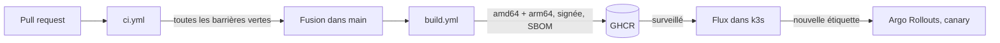

# CI/CD

Ce document décrit les deux workflows GitHub Actions de Vigie, les barrières qu'ils
appliquent et la façon dont une image publiée arrive en production. Il sert aussi de
contrat pour les jalons qui n'ont pas encore fusionné : chaque job s'active seul dès que
les fichiers dont il dépend existent.

## Vue d'ensemble



La livraison continue est **tirée** : GitHub publie une image, et c'est Flux, dans le
cluster, qui vient la chercher. Le port 6443 n'est jamais ouvert sur Internet et aucun
kubeconfig n'est stocké dans GitHub (brief, section 11.9). Il n'y a donc pas de `cd.yml` :
côté GitHub, la CD se résume à la publication de l'image.

## `ci.yml` : sur chaque pull request et sur `main`

| Job | Ce qu'il bloque | Actif quand |
|---|---|---|
| `quality` | ruff, ruff format, mypy strict sur `src` et `scripts`, pytest, planchers de couverture | toujours |
| `workflows` | workflow invalide ou script shell fragile (actionlint et shellcheck) | toujours |
| `pair-credit` | commit sans `Co-authored-by` d'Emilien Morice et dont il n'est pas l'auteur | pull request, sauf Dependabot |
| `secrets` | secret détecté par gitleaks dans l'historique de la branche | toujours |
| `pip-audit` | dépendance Python avec une vulnérabilité connue | toujours |
| `web` | build Vite, tests vitest, tests Playwright | `web/package-lock.json` existe |
| `npm-audit` | dépendance npm avec une vulnérabilité `high` ou `critical` | `web/` ou `redteam/` existe |
| `eval-gate` | régression des métriques déterministes sous les seuils | `src/vigie/evaluation/gate.py` (commande `vigie-eval gate`) et `eval/thresholds.yaml` existent |
| `redteam-gate` | plus de 5 % d'attaques réussies au rejeu Promptfoo | `redteam/replay.yaml`, `redteam/attacks.generated.yaml` et `docker-compose.yml` existent |

Le job `detect` calcule ces conditions avec `hashFiles` une seule fois, puis les autres
jobs lisent ses sorties. `hashFiles` n'est pas disponible dans le `if` d'un job, d'où ce
détour.

### Planchers de couverture

`python tasks.py coverage-gate` lit `coverage.json` et applique les seuils de la
section 11.3 : 80 % sur tout `src/`, 95 % sur `src/vigie/guard`,
`src/vigie/rag/citations.py`, `src/vigie/api/auth`, `src/vigie/api/usage` et
`src/vigie/drift`. Un module qui n'existe pas encore est signalé `absent` et ne bloque
pas ; son plancher s'applique dès qu'il arrive. Les seuils vivent dans `tasks.py`, ce qui
garantit que la CI et `python tasks.py check` en local appliquent les mêmes.

### Crédit du binôme

`scripts/check_coauthors.py <base>..<head>` relit les commits de la pull request et
refuse tout commit qui ne crédite pas Emilien Morice, comme auteur ou par un trailer
`Co-authored-by` à son adresse. Le hook local `prepare-commit-msg` ajoute ce trailer, mais
un hook peut être désactivé ou un outil peut perdre les trailers en réécrivant un commit :
la CI vérifie donc le résultat plutôt que de faire confiance au hook.

Les pull requests de Dependabot sont exemptées, le robot ne peut pas porter ce trailer.
Un bouton « Update branch » de l'interface GitHub crée un commit de fusion sans trailer :
mettre la branche à jour en local, où le hook s'applique.

### Contrats attendus des autres jalons

Ces commandes sont appelées telles quelles par la CI. Le jalon qui les livre doit les
respecter, ou modifier `ci.yml` dans la même pull request.

- **J1 corpus** : `vigie-ingest --out data/corpus/` télécharge le corpus depuis Cellar.
  Le cache CI est indexé sur `data/corpus.lock`, `src/vigie/corpus/parse.py` et
  `src/vigie/config.py`.
- **J8 évaluation** : `vigie-eval validate-golden` (déjà livré) et
  `vigie-eval gate --thresholds eval/thresholds.yaml --split test`, code de sortie non nul
  sous un seuil. Les rapports éventuels sont écrits dans `results/`. Le job tourne avec
  `VIGIE_LLM_PROVIDER=fake` et `VIGIE_QDRANT_PATH` (Qdrant embarqué, sans serveur).
- **J7 Docker** : `docker-compose.yml` avec un service `api` doté d'un healthcheck,
  publiant le port 8710 sur l'hôte et transmettant `VIGIE_LLM_PROVIDER` depuis
  l'environnement. Dockerfiles `deploy/docker/api.Dockerfile` et
  `deploy/docker/web.Dockerfile`, contexte de build à la racine du dépôt.
- **J5 API** : `python -m vigie.api.tokens create <utilisateur>` affiche un jeton
  `vig_...`. Le job le masque (`::add-mask::`) avant toute autre sortie.
- **J10 red teaming** : `python tasks.py redteam` avec `VIGIE_REDTEAM_BASE_URL` et
  `VIGIE_REDTEAM_TOKEN`, après `npm ci` dans `redteam/`.
- **J6 interface** : dans `web/`, les scripts `npm run build`, `npx vitest run` et
  `npx playwright test`.

## `build.yml` : sur `main` et sur les étiquettes `v*`

Pour chacune des images `api` et `web` :

1. **Build amd64 local et Trivy** : l'image est construite sans être poussée, puis
   analysée. Une vulnérabilité `CRITICAL` ou `HIGH` qui a un correctif fait échouer le
   job, et l'image n'atteint jamais le registre. Les vulnérabilités sans correctif ne
   bloquent pas, puisqu'aucune action ne permettrait de les lever.
2. **Build multi-architecture** `linux/amd64,linux/arm64` (QEMU, Buildx, cache
   `type=gha`), poussé sur GHCR avec une attestation de provenance.
3. **SBOM CycloneDX** produit par Syft sur le digest poussé, conservé en artefact du run.
4. **Signature cosign sans clé** du digest, puis attestation du SBOM sur ce même digest.
   La signature repose sur le jeton OIDC du run : aucune clé privée à garder.

Étiquettes publiées :

| Étiquette | Exemple | Usage |
|---|---|---|
| SHA complet du commit | `ghcr.io/adam-blf/vigie-api:3f9c...` | référence stable, celle qu'on cite |
| `main-<horodatage UTC>-<sha court>` | `main-20261002153000-3f9c2a1` | tri par Flux, sur `main` seulement |
| version semver | `1.2.0` | étiquettes `v*` seulement |

Jamais d'étiquette `latest`. L'étiquette horodatée existe parce qu'une `ImagePolicy` de
Flux doit pouvoir classer les images, et qu'un SHA seul n'a pas d'ordre. La politique
côté cluster (jalon J13) ressemble à ceci :

```yaml
filterTags:
  pattern: '^main-(?P<ts>[0-9]{14})-[a-f0-9]+$'
  extract: '$ts'
policy:
  numerical:
    order: asc
```

Pour vérifier une image avant de la déployer à la main :

```sh
cosign verify ghcr.io/adam-blf/vigie-api@sha256:... \
  --certificate-identity-regexp '^https://github.com/Adam-Blf/vigie/' \
  --certificate-oidc-issuer https://token.actions.githubusercontent.com
```

## Chaîne d'approvisionnement

- Toutes les actions tierces sont épinglées par **SHA de commit complet**, l'étiquette
  restant en commentaire pour Dependabot. Les SHA ont été lus avec
  `gh api repos/<propriétaire>/<dépôt>/git/refs/tags/<étiquette>` (et
  `git/tags/<sha>` pour une étiquette annotée), voir `docs/proofs/J15/action-shas.txt`.
- `aquasecurity/trivy-action` est épinglé sur `v0.36.0`, une release immuable publiée
  après le détournement des étiquettes de ce dépôt en mars 2026 (CVE-2026-33634), avec
  Trivy `v0.70.0`, postérieur à la version compromise `0.69.4`.
- `permissions: contents: read` par défaut, élargies job par job seulement là où il le
  faut (`packages: write` et `id-token: write` pour la publication, `pull-requests: read`
  pour gitleaks).
- Aucun `pull_request_target`, `persist-credentials: false` sur chaque checkout.
- Groupes de concurrence : une nouvelle poussée annule la CI en cours sur la même branche ;
  une publication d'image n'est jamais annulée en cours de route, pour ne pas laisser une
  image poussée sans signature.
- Dependabot chaque lundi pour pip, npm (`web/`, `redteam/`), GitHub Actions (workflows et
  action composite) et les images de base Docker, avec un délai de 7 jours après chaque
  publication.
- `tests/test_workflow_policy.py` vérifie ces règles sur le texte des workflows, ce
  qu'actionlint ne fait pas : un workflow peut être valide et appeler une action par une
  étiquette déplaçable.

## Activer les workflows

Le dépôt GitHub n'existe pas encore. À sa création :

1. Pousser `main` ; les workflows s'activent seuls.
2. **Settings, Actions, General** : « Read repository contents permission » par défaut,
   et refuser aux workflows la création de pull requests.
3. **Settings, Branches** : protéger `main`, exiger une pull request et les jobs
   `quality`, `workflows`, `pair-credit`, `secrets`, `pip-audit` (puis `web`, `eval-gate`,
   `redteam-gate` quand ils existent).
4. Paquets GHCR `vigie-api` et `vigie-web` : publics, selon la valeur par défaut de la
   décision 4 (aucun secret dans les images).
5. gitleaks-action ne demande une licence que pour un dépôt d'organisation. Le dépôt est
   sous le compte personnel `Adam-Blf`, aucune clé n'est nécessaire.

## Barrières vues rouges

| Barrière | Preuve |
|---|---|
| crédit du binôme | `docs/proofs/gates/coauthor-red.txt` |
| plancher de couverture | `docs/proofs/gates/coverage-red.txt` |
| épinglage des actions | `docs/proofs/gates/pinning-red.txt` |
| actionlint | `docs/proofs/gates/actionlint-red.txt` |

Chaque cas a été produit sur une branche jetable `test/gate-<nom>`, supprimée ensuite.
