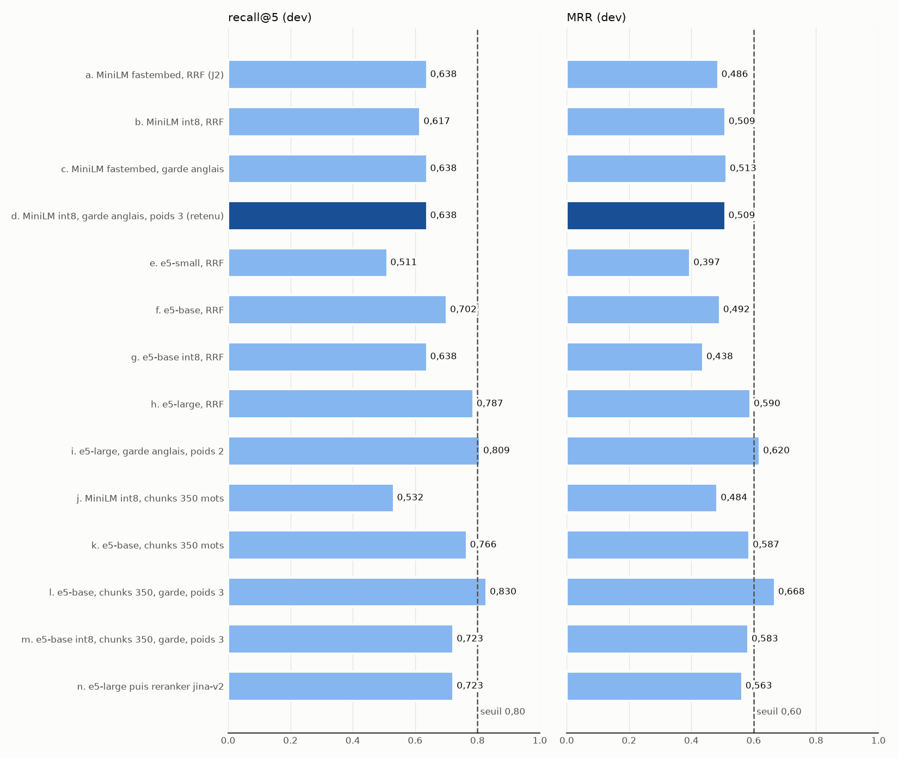

# Évaluation et registre MLflow (jalon J8)

Le jalon J8 donne à Vigie une boucle d'évaluation reproductible : mesurer une
configuration de recherche sur le jeu de référence, la journaliser dans MLflow, la
confronter aux seuils de `eval/thresholds.yaml`, puis l'enregistrer dans le registre
`vigie-rag` seulement si la barrière passe. Ce document décrit le protocole, compare les
modèles d'embedding essayés et donne le chiffre publié, mesuré une seule fois sur la partie
`test`.

## Protocole

- **Jeu de référence** : `data/golden/questions.jsonl`, 80 questions. La partie `dev`
  (54 questions, dont 47 attendent au moins un article) sert à tous les choix. La partie
  `test` (26 questions, dont 23 attendent un article) est scellée par SHA-256
  (`data/golden/test.sha256`) et n'a été lue qu'une fois, pour la configuration retenue,
  après le choix.
- **Métriques déterministes** (`src/vigie/evaluation/metrics.py`) : recall@5 et MRR sur
  des articles distincts (20 passages demandés par question pour en tirer 5 articles),
  taux de citations brutes valides, citations inventées restées dans la réponse finale,
  précision et couverture des citations, taux de refus correct.
- **Faux LLM** : le pipeline complet tourne avec `FakeLLM(hallucinate=True)`. Il cite les
  premiers passages reçus et ajoute à chaque réponse une citation inventée
  (`[DORA art. 999 §9]`). Un taux brut sous 1 avec zéro citation inventée dans la réponse
  finale prouve que le filtre de citations agit. Précision, couverture et refus dépendent
  du modèle : avec le faux LLM ils décrivent la recherche, pas l'assistant, et la barrière
  ne les juge que pour un vrai LLM.
- **Intervalles de confiance** : bootstrap par percentiles, 1 000 tirages de questions,
  graine `20261002` (section `bootstrap` des seuils), pour recall@5, MRR, précision et
  couverture.
- **Refus** : sur une mesure `dev`, les 7 questions hors périmètre de `dev` ; sur `test`,
  les 10 questions hors périmètre, comme l'explique `data/golden/README.md`.

## Commandes

```sh
# Mesure d'une configuration (variables VIGIE_*), rapport JSON et run MLflow
vigie-eval run --split dev --run-name essai
# Barrière : planchers, puis non-régression face au champion (fichier ou registre)
vigie-eval gate --report results/eval/report.json --champion
# Enregistrement d'une version, refusé si la barrière échoue
vigie-eval register <run_id> --alias challenger
# Alias du registre
vigie-eval alias show
vigie-eval alias set champion 3
vigie-eval alias remove challenger
```

`--tracking-uri` choisit le serveur. Par défaut, `sqlite:///mlruns/mlflow.db` avec les
artefacts sous `mlruns/artifacts`, deux chemins ignorés par le dépôt : MLflow 3 refuse
son ancien stockage en dossier simple, et SQLite ne demande rien de plus. `--llm none`
mesure la recherche seule, `--llm configured` passe par le LLM des réglages, `--no-mlflow`
écrit seulement le rapport.

Chaque run journalise en paramètres le modèle d'embedding et son empreinte
(`embedding_id`), le modèle creux et sa langue, la fusion, `rrf_k`, la profondeur de
prefetch, le reranker, l'épinglage des références, `top_k`, le découpage, le nombre de
chunks, `corpus_sha256`, la collection Qdrant, la version du prompt, le LLM et l'étiquette
Ollama épinglée ; en métriques les valeurs et les bornes des intervalles ; en artefact le
rapport complet (`report/report.json`).

## Registre `vigie-rag`

Une version n'est créée que pour un run dont la barrière passe
(`registry.register_version` lève `GateFailedError` sinon). Elle pointe sur le run et
contient `bundle/bundle.json` : modèle dense, modèle creux et empreinte, réglages de
recherche (fusion, poids, reranker, `top_k`), version du prompt, étiquette Ollama
épinglée, seuils des garde-fous, `corpus_sha256`, nom de la collection Qdrant,
`fault_injection.error_rate` à 0, et les métriques qui ont justifié la version. L'alias
`champion` désigne la production, `challenger` le canary. L'API ne contacte jamais
MLflow : une étape de la CD lit les alias et écrit les ConfigMaps (brief, section 11.8).

État au 6 octobre 2026 : **aucune version enregistrée**. La configuration retenue ne passe
pas les planchers de recherche sur `test` (voir plus bas), et `vigie-eval register` l'a
refusée (`docs/proofs/J8/eval/register-refused.txt`, code de sortie 1). Le chemin complet,
version créée, bundle écrit, alias posés puis déplacés, est couvert par les tests sur un
client MLflow en mémoire (`tests/test_eval_registry.py`, `tests/test_eval_run_cli.py`).

Une promotion qui passe a quand même été vue de bout en bout, sur un magasin MLflow jetable
et non sur le registre du dépôt (`docs/proofs/J8/eval/promotion-demo-dev.txt`). Le run est
celui de e5-large avec garde anglais et poids dense 2, mesuré à nouveau sur `dev`
(recall@5 0,8085, MRR 0,620, mêmes chiffres que le run i). La barrière passe avec une copie
des seuils réglée sur `dev` (`docs/proofs/gates/thresholds-dev-copy.yaml`, mêmes valeurs,
seule la partie change), `vigie-eval register` crée la version 1 de `vigie-rag` et pose
`challenger`. Cette preuve montre le mécanisme et rien d'autre : `dev` a servi à choisir la
configuration, donc le chiffre est optimiste, et e5-large ne tient pas dans le pod de l'API.
Aucun champion n'existe, et `eval/thresholds.yaml` n'a pas bougé.

## Barrière

Planchers de `eval/thresholds.yaml` (recall@5 au moins 0,80, MRR au moins 0,60, zéro
citation inventée, plus précision, couverture et refus pour un vrai LLM), puis
non-régression : recall@5 et taux de citations brutes valides ne perdent pas plus de
2 points face au champion. Les planchers ne valent que pour la partie sur laquelle ils sont
écrits (`split: test`).

Vue rouge (`docs/proofs/gates/`) :

| Preuve | Entrée | Résultat |
|---|---|---|
| `eval-gate-test-floors.txt` | rapport `test` de la configuration retenue | rouge : recall@5 0,652 et MRR 0,514 sous les planchers |
| `eval-gate-degraded-regression.txt` | configuration dégradée (poids dense 0,05, BM25 sur toutes les questions) face au rapport retenu, copie des seuils réglée sur `dev` | rouge : planchers, et recall@5 en baisse de 10,6 points face au champion |
| `eval-gate-chosen-vs-itself.txt` | le rapport retenu face à lui-même | non-régression verte, planchers rouges : la vérification relative ne masque pas les planchers |

En CI, deux niveaux. Les tests (`tests/test_eval_run_cli.py`) font tourner `run`, `gate`
et `register` sur un petit index Qdrant construit à partir du mini-corpus de fixture, avec
les vrais seuils : vert sur la configuration de référence, rouge sur un rapport dégradé et
sur un run `dev`. Le job `eval-gate` de `.github/workflows/ci.yml` mesure le vrai corpus :
corpus, modèles et index en cache, `vigie-index`, `vigie-eval run --split test`, puis
`vigie-eval gate`. Il mesure la copie fastembed de MiniLM avec les mêmes réglages de fusion,
car le fichier int8 de production s'exporte avec torch, absent de la CI. Tant que les
planchers de recherche ne sont pas atteints, ce job est rouge : c'est l'état réel du
jalon J2, pas une panne. Quand un champion existera, son rapport passera en
`--baseline` pour ajouter la non-régression.

## Comparaison des configurations, partie `dev`

47 questions `dev` qui attendent un article. Chaque ligne est un run MLflow de
l'expérience `vigie-eval` (rapports et sorties dans `docs/proofs/J8/eval/runs/`). Le
« garde anglais » laisse BM25 hors des questions détectées comme anglaises
(`src/vigie/retrieval/language.py`, 54 questions `dev` sur 54 bien classées). Mémoire
mesurée par `docs/proofs/J8/eval/memory.py` (processus Python seul, modèle chargé, un
passage et une question encodés).

| Run | Configuration | recall@5 | MRR | Mémoire | Tient sur la VM |
|---|---|---|---|---|---|
| a | MiniLM-L12 fastembed, RRF k = 60 (J2) | 0,638 | 0,486 | 616 Mio | oui |
| b | MiniLM-L12 int8 (export J12, 128 jetons) | 0,617 | 0,509 | 453 Mio | oui |
| c | MiniLM-L12 fastembed, garde anglais | 0,638 | 0,513 | 616 Mio | oui |
| **d** | **MiniLM-L12 int8, garde anglais, poids dense 3 (retenu)** | **0,638** | **0,509** | **453 Mio** | **oui** |
| e | multilingual-e5-small | 0,511 | 0,397 | 490 Mio (int8) | oui |
| f | multilingual-e5-base | 0,702 | 0,492 | 1 445 Mio | non |
| g | multilingual-e5-base int8 | 0,638 | 0,438 | 666 Mio | non (avec l'API et le garde-fou) |
| h | multilingual-e5-large | 0,787 | 0,590 | 1 560 Mio | non |
| i | multilingual-e5-large, garde anglais, poids dense 2 | 0,809 | 0,620 | 1 560 Mio | non |
| j | MiniLM-L12 int8, chunks de 350 mots | 0,532 | 0,484 | 453 Mio | oui |
| k | multilingual-e5-base, chunks de 350 mots | 0,766 | 0,587 | 1 445 Mio | non |
| l | multilingual-e5-base, chunks de 350 mots, garde anglais, poids 3 | 0,830 | 0,668 | 1 445 Mio | non |
| m | multilingual-e5-base int8, chunks de 350 mots, garde anglais, poids 3 | 0,723 | 0,583 | 666 Mio | non |
| n | multilingual-e5-large puis reranker jina-v2-base-multilingual sur 30 candidats | 0,723 | 0,563 | 12 Go en pointe pendant la mesure | non |



Lecture :

- **Le modèle dense compte plus que tout le reste.** e5-large seul fait 0,787 de rappel là
  où MiniLM plafonne à 0,64. Les préfixes `query: ` et `passage: ` qu'attend e5 sont posés
  par `src/vigie/retrieval/models.py`.
- **BM25 dilue les bons modèles.** Diagnostic branche par branche
  (`docs/proofs/J8/eval/branches.txt`) : BM25 seul fait 0,362, et un tiers des questions
  sont en anglais quand il racine du français. Le garde anglais ajoute 2 points de rappel
  à e5-large et 2,7 points de MRR à MiniLM, sans rien retirer ailleurs.
- **Le découpage aide e5, pas MiniLM.** Avec des chunks de 350 mots, à peu près la fenêtre
  de 512 jetons d'e5, e5-base gagne 6 points ; MiniLM, qui ne lit que 128 jetons, en perd
  8,5, comme au J2.
- **int8 ne convient qu'à MiniLM.** Pour MiniLM, l'écart tient à une question sur 47 :
  avec la fusion du J2, int8 perd 2,1 points de rappel (runs a et b, 0,638 contre 0,617) ;
  avec la fusion retenue, il en gagne 2,1 (0,638 contre 0,617 pour fastembed avec le même
  poids et le même garde, `branches.txt`). Pour e5-base, int8 coûte 6 à 11 points (runs f
  et g, l et m), bien au-delà du bruit.
- **Le reranker dégrade et ne tient pas.** Sur e5-large, jina-v2 fait perdre 6 points de
  rappel et prend environ 73 s par question sur le poste ; il lit des articles réglementaires
  français longs, loin de ce qu'il a appris. Il reste disponible (`VIGIE_RERANK_MODEL`),
  éteint par défaut.
- **L'épinglage des références** ne change rien sur le jeu de référence, qui ne cite aucun
  article par son numéro, mais règle la démo du J2 : « l'article 28 de DORA » ramène
  désormais DORA art. 28 aux trois premiers rangs (`docs/proofs/J8/eval/demo-top5.txt`).

## Choix et budget mémoire

La meilleure configuration mesurée, **e5-base en chunks de 350 mots avec le garde anglais**
(run l, 0,830 et 0,668 sur `dev`), et la meilleure à découpage inchangé, **e5-large avec le
garde anglais** (run i, 0,809 et 0,620), passent les planchers sur `dev`. Aucune ne tient
dans le pod de l'API : le brief (section 11.7) lui donne 0,7 Go, sans torch, garde-fou
DeBERTa ONNX compris. e5-base occupe 1,4 Gio en fp32 et 666 Mio en int8, mais int8 lui fait
perdre 11 points ; e5-large dépasse 1,5 Gio. Sur les deux cœurs Arm de la VM, encoder chaque
question avec e5-large prendrait aussi une part du budget de 500 ms au p95 du test de
charge.

**Configuration retenue, run d** : MiniLM-L12 en ONNX int8 (`VIGIE_DENSE_VARIANT=int8`,
fenêtre de 128 jetons), BM25 français, RRF k = 60 avec un poids dense de 3, BM25 laissé de
côté sur les questions anglaises, épinglage des références, sans reranker, `top_k` = 6.
C'est la seule configuration mesurée qui tient dans 0,7 Go avec l'API et le garde-fou
(453 Mio pour le processus et le modèle). Elle applique la décision du J12 : avec la fusion
retenue, int8 fait aussi bien que le modèle fastembed sur `dev` (0,638 contre 0,617 pour
fastembed avec les mêmes réglages, une question d'écart).

## Résultat publié, partie `test`

Mesuré une fois, le 6 octobre 2026, run MLflow `test-chosen-minilm-int8-gated-w3`
(`docs/proofs/J8/eval/run-test.txt`, `report-test.json`), 23 questions qui attendent un
article :

| Métrique | Valeur | IC 95 % | Plancher |
|---|---|---|---|
| recall@5 | 0,652 | [0,435 ; 0,826] | 0,80, non atteint |
| MRR | 0,514 | [0,344 ; 0,692] | 0,60, non atteint |
| citations inventées dans la réponse finale | 0 | | 0, atteint |
| citations brutes valides (faux LLM qui invente) | 0,733 | | |

Les planchers de recherche ne sont pas atteints avec ce qui tient sur la VM, et le jalon J2
reste `PARTIEL`. Aucun seuil n'a été abaissé, aucune question modifiée. Le chemin vers les
planchers est mesuré : e5-base en chunks de 350 mots les passe sur `dev`, à condition de lui
trouver la mémoire (un pod d'embedding séparé, ou un budget revu par Adam avec un ADR).

## Taille du contexte donné au LLM

Le J12 a vu 3 réponses sur 10 avec une citation valide et un premier token à 60 s sur le
poste. Mesure sur les 54 questions `dev` avec la configuration retenue
(`docs/proofs/J8/eval/context-size.txt`) : les 6 passages font en médiane 2 280 mots, le
plus long passage 801 mots, le prompt 2 565 mots, soit environ 3 850 jetons à 1,5 jeton
par mot, pour un `num_ctx` de 4 096. **24 prompts sur 54 dépassent la fenêtre** : Ollama
tronque alors le prompt, et les consignes de citation peuvent disparaître. La correction
(moins de passages, ou des passages plus courts) relève du prompt et du pipeline ; elle est
notée dans `docs/progress.md`.

## Interface MLflow

`mlflow ui --backend-store-uri sqlite:///mlruns/mlflow.db --host 127.0.0.1` puis la vue de
comparaison des runs : capture `docs/proofs/J8/eval/mlflow-compare-runs.png` (cinq runs
comparés, prise par Playwright en mode isolé sur Edge).
