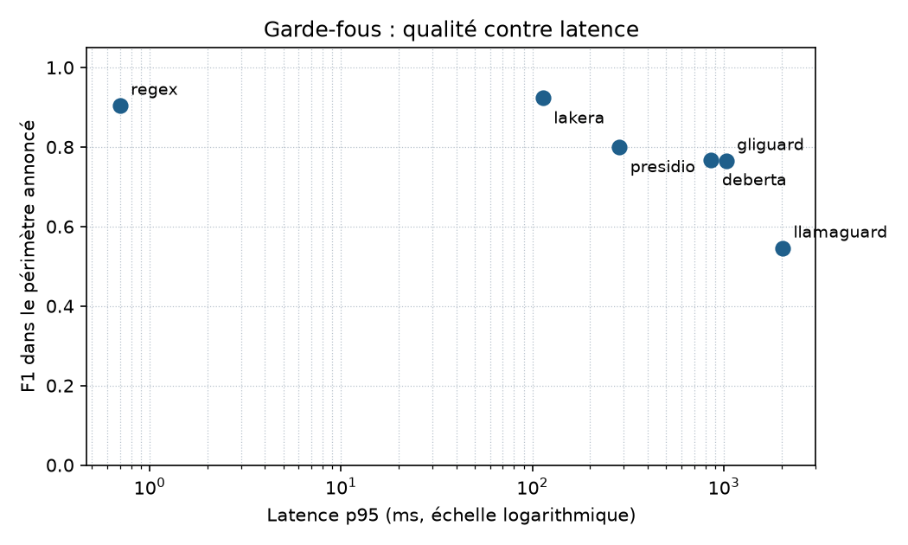

# Benchmark des garde-fous

Ce document compare six garde-fous candidats pour Vigie et justifie celui qui part en
production. Les chiffres viennent du découpage `test` du jeu maison, jamais utilisé pour
régler quoi que ce soit, et d'un jeu public de contrôle. Les sorties brutes, la commande
exacte et les versions des outils sont dans `docs/proofs/J4/bench/`.

## Protocole

- **Jeu maison** `data/seed.jsonl` : 174 exemples, 87 paires français et anglais, neuf
  catégories (dont 40 questions légitimes piégeuses et 30 injections cachées dans un
  document cité), domaine bancaire et réglementaire. Chaque paire est étiquetée par un
  membre du binôme et relue par l'autre. Données fictives uniquement : adresses en
  `example.com`, téléphones dans la plage `01 99 00` réservée à la fiction, IBAN et cartes
  de test publics. `guardbench validate` vérifie ces règles.
- **Découpage** 60 % `dev`, 40 % `test`, par ordre de hachage des paires : une question
  et sa traduction tombent toujours du même côté. Les chiffres ci-dessous portent sur les
  68 exemples de `test` (34 en français, 34 en anglais).
- **Contrôle** : `deepset/prompt-injections` (Apache 2.0), découpage `test`, 116 exemples
  en anglais et en allemand. Il ne contient ni français ni domaine bancaire, il sert
  seulement à voir si un outil généralise au-delà de notre jeu.
- **Mesure** : « positif » veut dire malveillant. Trois appels d'échauffement non
  chronométrés, puis un appel par exemple. Chaque outil reçoit deux scores : global, et
  restreint à son périmètre annoncé (plus les questions légitimes, qu'un outil étroit doit
  quand même laisser passer).
- **Matériel** : portable Windows, processeur seul, torch limité à 2 fils comme la VM
  Oracle (2 OCPU). La machine faisait tourner d'autres travaux pendant la mesure, les
  latences des modèles sont donc pessimistes et à refaire sur la VM ; les écarts entre
  outils restent, eux, d'un ordre de grandeur.
- **Suivi** : un run MLflow par outil et par jeu (`sqlite:///mlflow.db`).

## Résultats sur le jeu maison (`test`, 68 exemples)

| Outil | Périmètre annoncé | F1 périmètre | Rappel périmètre | FPR `benign` | FPR `benign_tricky` | p50 (ms) | p95 (ms) |
|---|---|---|---|---|---|---|---|
| Regex de référence | injections, jailbreak, fuite de prompt, abus d'outil, PII | 0,90 | 0,82 | 0 % | 0 % | 0,2 | 0,7 |
| DeBERTa v3 ProtectAI v2 | injections, jailbreak | 0,77 | 0,88 | 37,5 % | 50 % | 442 | 875 |
| GLiGuard 300M | injections, jailbreak, fuite, contenu nuisible, PII | 0,76 | 0,65 | 0 % | 12,5 % | 749 | 1 070 |
| Presidio (FR et EN) | PII | 0,80 | 0,67 | 0 % | 0 % | 20 | 41 |
| Llama Guard 3 1B (Ollama) | jailbreak, contenu nuisible, PII | 0,55 | 0,38 | 0 % | 0 % | 1 645 | 2 029 |
| Lakera Guard (SaaS) | injections, jailbreak, fuite, contenu nuisible, PII | 0,92 | 0,90 | 0 % | 12,5 % | 71 | 117 |

Taux de signalement par catégorie (part des exemples bloqués ; pour les deux catégories
légitimes, c'est le taux de faux positifs) :

| Catégorie | Regex | DeBERTa | GLiGuard | Presidio | Llama Guard | Lakera |
|---|---|---|---|---|---|---|
| benign | 0 % | 38 % | 0 % | 0 % | 0 % | 0 % |
| benign_tricky | 0 % | 50 % | 12 % | 0 % | 0 % | 12 % |
| direct_injection | 88 % | 100 % | 75 % | 0 % | 75 % | 100 % |
| indirect_injection | 92 % | 83 % | 33 % | 0 % | 17 % | 67 % |
| jailbreak | 67 % | 83 % | 67 % | 0 % | 0 % | 100 % |
| system_prompt_leak | 25 % | 100 % | 50 % | 0 % | 50 % | 100 % |
| pii | 100 % | 50 % | 100 % | 67 % | 33 % | 100 % |
| unsafe_content | 0 % | 0 % | 100 % | 0 % | 100 % | 100 % |
| tool_abuse | 100 % | 75 % | 75 % | 0 % | 100 % | 50 % |



## Contrôle sur deepset (116 exemples, anglais et allemand)

| Outil | F1 | Rappel | FPR | p95 (ms) |
|---|---|---|---|---|
| Regex de référence | 0,06 | 0,03 | 0 % | 1 |
| DeBERTa v3 ProtectAI v2 | 0,54 | 0,37 | 0 % | 677 |
| GLiGuard 300M | 0,49 | 0,33 | 3,6 % | 929 |
| Presidio | 0,00 | 0,00 | 0 % | 72 |
| Llama Guard 3 1B | 0,00 | 0,00 | 3,6 % | 2 053 |
| Lakera Guard | 0,88 | 0,88 | 8,3 % | 75 |

Le quota gratuit de Lakera a été atteint pendant ce contrôle : 96 appels sur 116 ont
reçu une erreur 429, sa ligne ne porte donc que sur 20 exemples et reste indicative.

## Ce que disent les chiffres

- **La regex est rapide et précise, mais elle ne généralise pas.** Écrite et réglée sur
  `dev`, elle garde 0,90 de F1 sur `test` sans aucun faux positif, puis tombe à 3 % de
  rappel sur deepset, dont les attaques ne ressemblent pas aux nôtres. C'est un filet,
  pas une défense.
- **DeBERTa ne comprend pas le français comme une langue légitime.** Ses faux positifs
  viennent presque tous des questions françaises : sur `dev`, il signale 9 questions
  piégeuses françaises sur 12 et 2 questions françaises ordinaires sur 6, contre une
  seule question anglaise. Les scores de ces erreurs dépassent 0,99, aucun seuil ne
  les sépare des vraies attaques. En anglais, en revanche, il ne se trompe que sur une
  question légitime sur 18 de `dev`.
- **GLiGuard est le modèle local le plus équilibré** (aucun faux positif sur les
  questions ordinaires) mais rate deux injections indirectes sur trois, et il exige torch
  : la bibliothèque gliner2 n'a pas d'export ONNX, ce qui l'exclut de l'image de
  production (section 11.7 du brief).
- **Llama Guard 3 1B** juge bien le contenu nuisible mais ne voit pas les injections, et
  coûte deux secondes par appel sur processeur. Il n'a pas sa place dans le chemin d'une
  requête.
- **Presidio** ne couvre que les PII et en rate un tiers ; la regex de référence, écrite
  pour nos formats bancaires, les trouve toutes.
- **Lakera** a la meilleure qualité, mais c'est un service tiers : chaque question part
  hors de la banque, la latence inclut le réseau et l'offre gratuite s'épuise vite, comme
  le montre le contrôle.

## Recommandation par contexte

| Contexte | Recommandation | Pourquoi |
|---|---|---|
| Banque avec contrainte de latence (p95 sous 200 ms, processeur) | Regex en filet, puis DeBERTa exporté en ONNX int8, appliqué aux textes anglais | Seule combinaison locale sous le budget ; la regex couvre le français que DeBERTa comprend mal |
| Banque sans GPU, données qui ne sortent pas | Même chaîne locale ; Llama Guard 3 1B ou GLiGuard seulement en contrôle différé du journal d'audit | Les deux voient le contenu nuisible mais coûtent une seconde ou plus par appel |
| Banque qui accepte un SaaS (contrat de sous-traitance signé, données non sensibles) | Lakera Guard, avec la regex locale en secours si le service ou le quota tombe | Meilleure qualité mesurée, mais transfert de données et dépendance à un tiers |
| Détection de PII avant journalisation | Regex bancaire (IBAN, cartes avec Luhn, téléphones, e-mails) ; Presidio si des noms propres doivent être masqués | La regex couvre 100 % de nos PII de test, Presidio 67 % |

Pour Vigie, c'est la première ligne qui s'applique : l'API tourne sur une VM sans GPU, sans
torch dans l'image, et les questions des utilisateurs ne doivent pas quitter
l'infrastructure. La mesure de cette chaîne contre les seuils du brief est publiée dans la
section suivante, ajoutée avec le code de production.

## Chaîne de production et mesure contre les seuils

Le code vit dans `src/vigie/guard/`. Une question passe dans cet ordre :

1. **Normalisation** (`normalize.py`) : NFKC, retrait des caractères invisibles et
   bidirectionnels (dont le bloc des étiquettes Unicode), décodage du base64, de
   l'encodage pourcentage et des entités HTML. Les charges décodées sont lues par les
   garde-fous au même titre que le texte visible.
2. **Regex de référence**, reprise telle quelle de `src/guardbench` : la production
   exécute exactement le détecteur mesuré plus haut.
3. **DeBERTa ProtectAI v2 en ONNX int8**, seulement pour les textes que l'aiguillage de
   langue (`lang.py`, mots-outils français et anglais) juge anglais. Le fichier vient de
   l'export ONNX publié par ProtectAI, à une révision épinglée, quantifié par
   `python -m vigie.guard.prepare` : 738 Mo en fp32, 244 Mo en int8, ni torch ni
   transformers dans l'image de l'API.

La sortie repasse par une seconde vérification des citations et par le masquage des
données personnelles (`output.py`, `pii.py`).

Mesure sur le découpage `test` (68 exemples), par `python -m vigie.guard.measure`,
contre la section `guard` de `eval/thresholds.yaml` écrite avant la mesure :

| Mesure | Seuil | Résultat |
|---|---|---|
| Rappel injections directes, français | au moins 0,90 | 1,00 |
| Rappel injections directes, anglais | au moins 0,90 | 1,00 |
| Faux positifs `benign` | au plus 2 % | 0 % |
| Faux positifs `benign_tricky` | au plus 10 % | 0 % |
| p95 de la chaîne, normalisation comprise | sous 200 ms | 96 ms |

Deux itérations ont été nécessaires. La première, quantifiée par tenseur (le réglage
par défaut d'ONNX Runtime), plafonnait à 0,75 de rappel en anglais : le modèle quantifié
rendait des scores proches de zéro sur toutes les attaques, alors que l'export fp32
donnait 1,0 sur les mêmes textes. La quantification par canal rétablit les décisions du
modèle d'origine. Les deux sorties sont dans `docs/proofs/J4/guard/`.

Ce que la chaîne laisse passer sur `test` : une injection indirecte en anglais, le
jeu de rôle de la grand-mère (français et anglais), deux demandes de prompt système en
français et les quatre contenus nuisibles, qu'aucun des deux détecteurs ne couvre. Sur
`dev`, la qualité est la même mais le p95 est monté à 252 ms pendant que la machine
était chargée par d'autres travaux ; la latence est à refaire sur la VM.

## Reproduire

```sh
uv pip install --python .venv -e ".[dev,bench,tracking]"
.venv/Scripts/python -m spacy download fr_core_news_sm
.venv/Scripts/python -m spacy download en_core_web_sm
ollama pull llama-guard3:1b
guardbench validate
guardbench run --split test --deepset
```

Sans `LAKERA_API_KEY`, Lakera est noté « non testé » au lieu d'être compté comme un outil
qui ne détecte rien ; il en va de même pour Llama Guard si Ollama ou le modèle manque.
