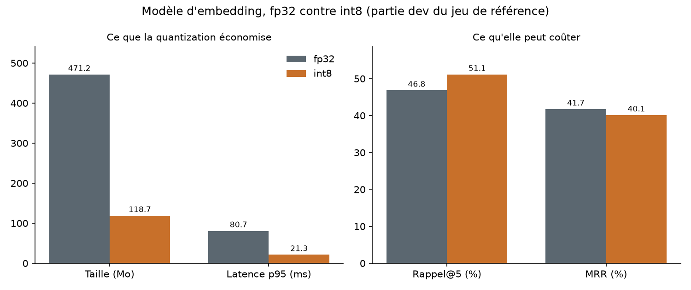

# Quantization (jalon J12)

Deux études, toutes deux gratuites et sur CPU. La première compare le modèle d'embedding
`sentence-transformers/paraphrase-multilingual-MiniLM-L12-v2` exporté en ONNX fp32 et sa
version int8. La seconde compare Ministral 3 3B en Q4_K_M et en Q8_0 servi par Ollama.

## Seuil fixé avant la mesure

La règle vient du brief (section 11.3) et a été écrite dans `eval/thresholds.yaml`
(section `quantization`) dans le commit `e5b8c0c`, poussé avant le premier export :

- int8 est retenu si le rappel@5 perd au plus 2 points **et** si le fichier fait au plus
  la moitié du fichier fp32 ;
- la décision se prend sur la partie `dev` du jeu de référence. La partie `test`, scellée
  par SHA-256, n'est jamais chargée par `vigie-quant` : `score_retrieval` refuse toute
  question qui n'est pas `dev`, et un seuil qui viserait `test` est refusé à la lecture.

## Méthode, modèle d'embedding

1. `vigie-quant export` charge le modèle à la révision épinglée
   `e8f8c211226b894fcb81acc59f3b34ba3efd5f42`, en safetensors, sans code distant, et
   l'exporte en ONNX (opset 18, exporteur `torch.onnx` dynamo). L'export s'arrête aux
   vecteurs de tokens : le mean pooling et la normalisation sont faits en numpy, à
   l'identique pour les deux variantes.
2. `onnxruntime.quantization.quantize_dynamic` produit la version int8 (poids int8,
   activations quantifiées à la volée, aucun jeu de calibration).
3. `vigie-quant parity` compare les vecteurs ONNX fp32 à ceux de PyTorch sur un lot
   rembourré. Écart maximal mesuré : 7,5e-8.
4. `vigie-quant embed` encode les 511 chunks du corpus (`vigie-ingest`, empreintes
   conformes à `data/corpus.lock`), puis cherche par similarité cosinus les 47 questions
   `dev` qui attendent au moins un article (40 dans le périmètre, 7 pièges). Plusieurs
   chunks d'un même article comptent une fois. Rappel@5 et MRR viennent de
   `vigie.evaluation.metrics`, les mêmes fonctions que la barrière d'évaluation.
5. Latence : chaque question est encodée seule, comme le fera l'API, trois passes sur les
   47 questions, les 5 premiers appels exclus (préchauffage), soit 136 mesures par
   variante.
6. Chaque variante est un run MLflow (expérience `vigie-quantization`, base SQLite locale
   non versionnée, `VIGIE_MLFLOW_TRACKING_URI`).

## Résultats, modèle d'embedding

Mesuré le 2026-10-06 sur le poste de développement (Windows 11, 8 cœurs logiques,
onnxruntime 1.30.0, fournisseur CPU). Sortie brute : `docs/proofs/J12/embed-run-2.txt`,
valeurs complètes : `docs/proofs/J12/embedding-results.json`.

| Variante | Taille | Rappel@5 (dev) | MRR (dev) | Latence p50 | Latence p95 |
|---|---|---|---|---|---|
| fp32 | 471,2 Mo | 0,468 | 0,417 | 27,1 ms | 80,7 ms |
| int8 | 118,7 Mo | 0,511 | 0,401 | 9,3 ms | 21,3 ms |
| écart int8 | ratio 0,252 | +4,3 points | -1,6 point | x 0,35 | x 0,26 |



Lecture :

- La taille est divisée par 4 : la table d'embeddings du vocabulaire (250 000 tokens) pèse
  l'essentiel du modèle et passe aussi en int8.
- Le rappel@5 ne baisse pas, il monte de 2 questions sur 47. Le MRR perd 1,6 point. Sur 47
  questions, un écart d'une ou deux questions reste du bruit : la bonne lecture est
  « aucune perte mesurable », pas « int8 est meilleur ».
- Les valeurs absolues (0,47 à 0,51) sont loin du plancher de 0,80 de la recherche. Ce
  plancher vise la recherche hybride de production (dense plus BM25 dans Qdrant, jalon
  J2) sur la partie `test`, pas cette recherche dense seule sur des chunks tronqués à 128
  tokens. Ici seul l'écart entre variantes compte, et les deux passent par exactement la
  même recherche.
- Les latences viennent d'un poste partagé avec d'autres tâches pendant la mesure, pas de
  la VM Arm : elles valent pour le rapport entre variantes, pas comme chiffre de
  production. Une seconde mesure sous une charge plus forte
  (`docs/proofs/J12/embed-gate-degraded-threshold.txt`) donne 70 ms contre 58 ms au p50,
  avec un rappel et un MRR identiques au chiffre près.

## Décision, modèle d'embedding

Perte de rappel@5 : -4,3 points (gain), au plus 2 points autorisés. Ratio de taille :
0,252, au plus 0,5 autorisé. Les deux conditions tiennent : **la version int8 est
retenue.** Elle est appliquée dans `src/vigie/config.py` (`dense_variant = "int8"`,
variable `VIGIE_DENSE_VARIANT`), et un test vérifie que ce réglage reste égal à la décision
enregistrée dans `docs/proofs/J12/embedding-results.json`.

Depuis le J8, la recherche hybride (`vigie.retrieval`) lit `dense_variant` : en int8 elle
charge `model-int8.onnx` dans `<VIGIE_QUANT_DIR>/<modèle en minuscules, tirets>/`, un
dossier par modèle (`vigie-quant export --models data/quant/<modèle>`), et le nom de la
collection Qdrant porte la variante et la fenêtre de jetons, si bien qu'un index fp32 n'est
jamais interrogé avec des vecteurs int8.

## Contrôle dans la recherche hybride (J8)

La décision ci-dessus a été prise sur une recherche dense seule. Le J8 l'a refaite dans la
recherche hybride de production, sur les 47 questions `dev` (détail dans
`docs/evaluation.md`) :

| Modèle | Configuration | fp32 (fastembed) | int8 (export J12) | Écart de rappel@5 |
|---|---|---|---|---|
| MiniLM-L12 | RRF k = 60, fusion du J2 | 0,638 | 0,617 | -2,1 points |
| MiniLM-L12 | garde anglais, poids dense 3 (retenue) | 0,617 | 0,638 | +2,1 points |
| e5-base | RRF k = 60 | 0,702 | 0,638 | -6,4 points |
| e5-base | chunks de 350 mots, garde anglais, poids 3 | 0,830 | 0,723 | -10,7 points |
| e5-base | même configuration, int8 par canal (7 octobre) | 0,830 | 0,809 | -2,1 points |

La colonne fastembed de MiniLM est elle-même une copie ONNX déjà quantifiée par Qdrant
(`qdrant/paraphrase-multilingual-MiniLM-L12-v2-onnx-Q`), lue sur 512 jetons. Pour MiniLM,
l'écart tient à une question sur 47 dans un sens ou dans l'autre selon la
fusion ; int8 reste déployé. Pour e5-base, la quantization dynamique fait perdre bien plus
que les 2 points permis avec une échelle par tenseur. Avec une échelle par canal de sortie,
désormais le défaut de `vigie-quant export` (`--per-tensor` rend l'ancien export), e5-base
int8 ne perd plus que 2,1 points (une question sur 47) pour un fichier au quart du fp32
(`docs/proofs/J8/eval/e5base-parity.txt`). Il reste trop lourd pour le pod de l'API :
1 019 Mio mesurés pour 950 permis (`docs/evaluation.md`, « Choix et budget mémoire »).

Barrière vue rouge : la même mesure avec une copie du seuil dégradée (`max_size_ratio`
ramené à 0,2) retient fp32 et donne le motif « int8 file is 0.25 of fp32, above 0.20 »
(`docs/proofs/J12/embed-gate-degraded-threshold.txt`).

## Incident de mesure, première exécution

La première exécution a donné un rappel@5 de 0,02 pour les deux variantes
(`docs/proofs/J12/embed-run-1-broken-export.txt`). Cause : avec l'attention SDPA de
transformers, l'exemple d'export sans rembourrage a produit un graphe qui ignorait le
masque d'attention, si bien que le rembourrage entrait dans la moyenne de chaque phrase
courte. Correctif : attention `eager` et exemple d'export avec une ligne rembourrée, puis
contrôle de parité ajouté (`vigie-quant parity`). Le seuil n'a pas bougé ; la seconde
exécution est celle retenue.

## Étude LLM, Q4_K_M contre Q8_0

Même modèle, deux quantizations GGUF déjà présentes dans l'Ollama local (0.35.1) :
`ministral-3:3b-instruct-2512-q4_K_M` (celle de la configuration) et
`ministral-3:3b-instruct-2512-q8_0`. `vigie-quant llm` :

- prend 10 questions `dev` dans le périmètre, fixes (triées par identifiant puis prises à
  pas réguliers, les quatre règlements représentés) ;
- récupère une seule fois les 6 passages de chaque question avec l'embedding int8
  retenu, pour que les deux variantes répondent sur un contexte identique ;
- envoie le prompt de production (`PROMPT_VERSION` v2, `num_ctx` 4096, 400 tokens au plus,
  température 0,1) **sur CPU seul** (`num_gpu: 0`), puisque la VM n'a pas de GPU ;
- préchauffe chaque modèle sur une question hors mesure, puis mesure le premier token
  côté client, le débit (`eval_count / eval_duration` d'Ollama), la mémoire du modèle
  chargé (`/api/ps`) et la qualité des citations avec `rag/citations.py` ;
- enregistre chaque réponse au fil de l'eau dans `docs/proofs/J12/llm-results.json` et un
  run MLflow par variante.

Mesuré le 2026-10-06, de 11h18 à 12h20, sur le même poste partagé. Sortie brute :
`docs/proofs/J12/llm-run-2.txt`.

| Variante | Premier token p50 | Premier token p95 | Débit | Mémoire | Réponses avec citation valide | Citations inventées | Article attendu cité | Refus |
|---|---|---|---|---|---|---|---|---|
| Q4_K_M | 60,2 s | 74,8 s | 4,37 tokens/s | 2,73 Go | 3 sur 10 | 0 | 1 sur 10 | 2 |
| Q8_0 | 127,8 s | 159,1 s | 3,23 tokens/s | 4,24 Go | 3 sur 10 | 0 | 1 sur 10 | 2 |

Lecture :

- La qualité est la même sur ce sous-ensemble : mêmes questions citées, même article
  attendu trouvé (`aiact-03`), mêmes refus. Q8_0 n'apporte rien de mesurable ici.
- Q4_K_M lit le prompt deux fois plus vite, décode 35 % plus vite et occupe 1,5 Go de
  moins. Il tient dans les 3,0 Go prévus pour Ollama au budget mémoire (brief 11.7), Q8_0
  le dépasse.
- Deux réponses Q4_K_M ont eu un premier token sous la seconde, servies en partie par le
  cache de prompt d'Ollama ; la médiane, sur 10 réponses, n'en dépend pas.
- Six réponses sur dix, dans les deux variantes, vont jusqu'à 400 tokens sans citer : le
  pipeline RAG les transforme en refus, puisque `rag_require_citation` est actif. C'est
  une limite du petit modèle avec ces passages, pas un effet de la quantization ; elle
  relève du réglage du prompt et de la recherche hybride (J2), sur la partie `dev`.
- Premier token d'une minute : le seuil « premier token sous 5 s » du brief porte sur la
  VM et sera mesuré là. Sur ce poste, la lecture d'un prompt de 4096 tokens par le CPU,
  partagé avec d'autres tâches, domine tout le reste.

**Décision LLM : Ministral 3B reste en Q4_K_M** (`VIGIE_OLLAMA_MODEL` inchangé). La
variante Q8_0 coûte 1,5 Go et deux fois plus d'attente pour une qualité identique sur ce
sous-ensemble.

Incident : la première exécution s'est arrêtée sur un délai de lecture de 120 s pendant la
lecture du prompt, en perdant 38 minutes de réponses gardées en mémoire
(`docs/proofs/J12/llm-run-1-timeout.txt`). Depuis, chaque réponse est écrite dès qu'elle
arrive et l'étude attend jusqu'à 900 s (`VIGIE_QUANT_LLM_TIMEOUT_S`). Une deuxième
exécution a été interrompue après une réponse : le préchauffage reprenait la première
question, que le cache de prompt servait en 0,4 s ; il porte désormais sur une question
hors mesure.

## Reproduire

```
uv pip install -e ".[quant,tracking]"
vigie-ingest
vigie-quant export
vigie-quant parity
vigie-quant embed
vigie-quant llm
vigie-quant chart
```

Les fichiers ONNX (`data/quant/`) et la base MLflow ne sont pas versionnés.
