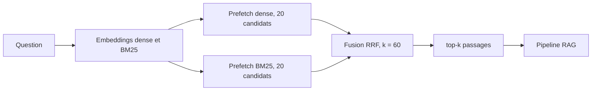

# Recherche hybride

Vigie retrouve les passages d'une question par deux chemins, puis fusionne les deux
classements dans Qdrant.

| Branche | Modèle | Ce qu'elle attrape |
|---|---|---|
| dense (`dense`, 384 dimensions, cosinus) | fastembed `sentence-transformers/paraphrase-multilingual-MiniLM-L12-v2` | les reformulations, et les questions en anglais sur un texte français |
| creuse (`bm25`, IDF calculé par Qdrant) | fastembed `Qdrant/bm25`, langue `french` | les mots exacts du règlement et les références du type « article 28 » |

La fusion est un RRF (reciprocal rank fusion) : chaque passage reçoit la somme de
`1/(k + position)` sur les deux listes. Le score dit à quel rang le passage est sorti, pas
à quel point il ressemble à la question.



fastembed tourne sur onnxruntime, sans torch, ce qui tient dans le budget mémoire de l'API.

## Commande `vigie-index`

Elle lit tous les JSONL de `data/corpus/` (produits par `vigie-ingest`), calcule les deux
vecteurs de chaque chunk et les charge dans Qdrant.

```sh
VIGIE_QDRANT_PATH=.qdrant vigie-index
```

| Option | Effet |
|---|---|
| `--corpus DOSSIER` | dossier des JSONL, `data/corpus` par défaut |
| `--force` | recalcule les vecteurs même si la collection est complète |

La commande affiche le nom de la collection, le nombre de chunks lus, de chunks calculés
et de points présents. Codes de sortie : `0` succès, `1` corpus vide ou Qdrant non
configuré.

Le texte calculé pour un chunk commence par sa référence et son intitulé
(`DORA article 28 Principes généraux`), puis le corps de l'article : le corps seul dit
rarement « DORA » ou « article 28 », alors que c'est ainsi que les questions sont posées.

## Idempotence et nommage

- Chaque point a un identifiant `uuid5` dérivé du règlement, de l'article, du paragraphe et
  de l'ancre ELI. Relancer l'indexation réécrit les mêmes points au lieu d'en ajouter.
- Une collection qui contient déjà le nombre de points attendu n'est pas recalculée.
- Le nom suit `vigie_<id embedding>_<empreinte corpus sur 8 caractères>`, par exemple
  `vigie_paraphrase-multilingual-minilm-l12-v2-f692d1_5abe72f5`. L'identifiant d'embedding
  porte un hachage des deux modèles et de la langue BM25 ; l'empreinte du corpus est un
  SHA-256 des chunks eux-mêmes. Un nouveau modèle ou un nouveau corpus crée donc une
  nouvelle collection, et revenir en arrière consiste à pointer sur l'ancienne.
- Un processus qui n'a pas le corpus sur disque, l'API en production, reçoit le nom par
  `VIGIE_QDRANT_COLLECTION`.
- La charge utile de chaque point reprend tous les champs du chunk.

## Quarantaine

`build_index` accepte un filtre `screen` qui renvoie le motif d'exclusion d'un chunk, ou
rien. Un chunk signalé n'est pas indexé, et il est retiré s'il l'avait été par une
exécution précédente. Le garde-fou d'entrée du jalon J4 se branchera là : un passage
porteur d'une injection atteindrait sinon le prompt par la recherche (injection indirecte,
voir `docs/risk-map.md`).

## Utilisation par le pipeline et l'API

`vigie.retrieval.factory.open_retriever(settings)` est un gestionnaire de contexte qui rend
un objet conforme au protocole `Retriever` du pipeline :
`search(question, top_k) -> list[Passage]`. La recherche Qdrant accepte en plus un filtre
`regulations=["DORA"]`. `VIGIE_RETRIEVER=static` avec `VIGIE_STATIC_PASSAGES_PATH` rejoue
un fichier de passages fixes, pour mesurer le modèle seul.

## Mesure sur la partie `dev`

```sh
VIGIE_QDRANT_PATH=.qdrant vigie-eval retrieval --split dev --out results/retrieval-dev.json
```

Les métriques portent sur des articles distincts : plusieurs paragraphes d'un même article
comptent pour un seul résultat, d'où les 20 passages demandés par question pour en tirer
5 articles. Seules les questions qui attendent un article comptent ; les questions hors
périmètre relèvent du taux de refus. La partie `test` reste scellée pour les chiffres
publiés et ne sert jamais à régler un paramètre.

Résultats du 6 octobre 2026 (preuves dans `docs/proofs/J2/`), 47 questions `dev` :

| Variante | recall@5 | MRR |
|---|---|---|
| dense seule | 0,532 | 0,422 |
| BM25 seule | 0,362 | 0,292 |
| RRF `FusionQuery`, constante fixée à 2 | 0,574 | 0,435 |
| RRF, k = 60 (retenu) | 0,638 | 0,486 |

Le seuil de `eval/thresholds.yaml` (recall@5 au moins 0,80, MRR au moins 0,60, mesurés sur
`test`) n'est pas atteint sur `dev`. Un découpage plus fin des articles (200 mots) a été
essayé et rejeté : recall@5 0,489. Les pistes suivantes relèvent du jalon J8 : le modèle
dense plus fort `intfloat/multilingual-e5-large` prévu par le brief, et un découpage qui
tienne dans les 512 jetons lus par le modèle dense.
