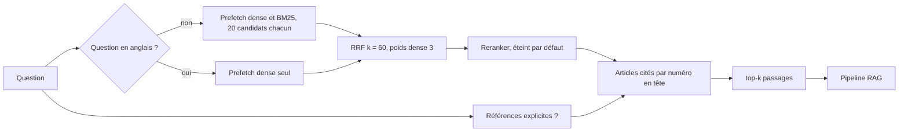

# Recherche hybride

Vigie retrouve les passages d'une question par deux chemins, puis fusionne les deux
classements dans Qdrant.

| Branche | Modèle | Ce qu'elle attrape |
|---|---|---|
| dense (`dense`, 384 dimensions, cosinus) | `sentence-transformers/paraphrase-multilingual-MiniLM-L12-v2` en ONNX int8 (export du J12, 128 jetons) | les reformulations, et les questions en anglais sur un texte français |
| creuse (`bm25`, IDF calculé par Qdrant) | fastembed `Qdrant/bm25`, langue `french` | les mots exacts du règlement, sur les questions en français |

La fusion est un RRF (reciprocal rank fusion) : chaque passage reçoit la somme de
`1/(k + position)` sur les deux listes, avec k = 60. Qdrant pondère en plus chaque liste
(`Rrf(weights=...)`) : 3 pour la liste dense, 1 pour BM25. Le score dit à quel rang le
passage est sorti, pas à quel point il ressemble à la question.



Ces réglages viennent du jalon J8, mesurés sur la partie `dev` du jeu de référence ; la
comparaison complète et le chiffre publié sur `test` sont dans `docs/evaluation.md`.

## Modèle dense et variante int8

`VIGIE_DENSE_VARIANT` choisit le fichier du modèle dense :

- `int8` (défaut, décision du J12) : le fichier ONNX quantifié par `vigie-quant export`,
  lu dans `<VIGIE_QUANT_DIR>/<modèle en minuscules, tirets>/model-int8.onnx` avec son
  `tokenizer.json`, tronqué à `VIGIE_DENSE_MAX_TOKENS` (128, la fenêtre d'entraînement de
  MiniLM ; 512 la lui fait perdre 21 points) ;
- `fp32` : la copie fastembed du modèle, comme au J2.

```sh
vigie-quant export --models data/quant/sentence-transformers-paraphrase-multilingual-minilm-l12-v2
```

Un fichier absent arrête la commande avec la marche à suivre. Les modèles e5
(`intfloat/multilingual-e5-small`, `-base`, `-large`) sont reconnus : leurs préfixes
`query: ` et `passage: ` sont ajoutés automatiquement (`src/vigie/retrieval/models.py`),
et les tailles small et base, que fastembed ne fournit pas, sont déclarées à partir de leur
export ONNX officiel.

## Garde anglais

BM25 racine du français. Sur une question en anglais il ne trouve que des nombres et des
sigles, et ses candidats repoussent les bons passages denses. `VIGIE_RETRIEVAL_SPARSE_ON_ENGLISH=false`
(défaut) le laisse de côté quand la question est détectée comme anglaise : la détection
compte les mots outils propres à chaque langue (`src/vigie/retrieval/language.py`), sans
modèle, et une égalité reste en français. Elle classe correctement les 54 questions `dev`.

## Références explicites

« article 28 DORA », « Art. 6 AI Act », « articles 28 et 30 du DORA » : quand une question
nomme un article et un règlement, les chunks de cet article passent en tête
(`src/vigie/retrieval/references.py`, trois chunks au plus par article, les chunks déjà
trouvés d'abord). Chaque numéro va au règlement nommé le plus proche dans la phrase ; un
numéro sans règlement n'est pas deviné. Le chunk épinglé prend le meilleur score de la
liste, pour que le seuil de score du pipeline ne l'écarte jamais.
`VIGIE_RETRIEVAL_PIN_REFERENCES=false` désactive l'épinglage.

## Reranker

`VIGIE_RERANK_MODEL` (vide par défaut) fait relire les `VIGIE_RERANK_DEPTH` premiers
candidats fusionnés par un cross-encoder fastembed, par exemple
`jinaai/jina-reranker-v2-base-multilingual`, sur les 1 500 premiers caractères de chaque
passage. Le score devient la sigmoïde du logit, entre 0 et 1. Mesuré au J8 sur e5-large,
il fait perdre 6 points de rappel et prend environ 73 s par question sur le poste : il
reste éteint.

## Commande `vigie-index`

Elle lit tous les JSONL de `data/corpus/` (produits par `vigie-ingest`), calcule les deux
vecteurs de chaque chunk et les charge dans Qdrant.

```sh
VIGIE_QDRANT_PATH=.qdrant vigie-index
```

| Option | Effet |
|---|---|
| `--corpus DOSSIER` | dossier des JSONL, `data/corpus` par défaut |
| `--force` | recalcule les vecteurs même si la collection est complète |

La commande affiche le nom de la collection, le nombre de chunks lus, de chunks calculés
et de points présents. Codes de sortie : `0` succès, `1` corpus vide ou Qdrant non
configuré.

Le texte calculé pour un chunk commence par sa référence et son intitulé
(`DORA article 28 Principes généraux`), puis le corps de l'article : le corps seul dit
rarement « DORA » ou « article 28 », alors que c'est ainsi que les questions sont posées.

## Idempotence et nommage

- Chaque point a un identifiant `uuid5` dérivé du règlement, de l'article, du paragraphe et
  de l'ancre ELI. Relancer l'indexation réécrit les mêmes points au lieu d'en ajouter.
- Une collection qui contient déjà le nombre de points attendu n'est pas recalculée.
- Le nom suit `vigie_<id embedding>_<empreinte corpus sur 8 caractères>`, par exemple
  `vigie_paraphrase-multilingual-minilm-l12-v2-int8-84396c_5abe72f5`. L'identifiant
  d'embedding porte un hachage des deux modèles, de la langue BM25 et, quand ils
  existent, du préfixe des passages, de la variante int8 et de sa fenêtre de jetons ;
  l'empreinte du corpus est un SHA-256 des chunks eux-mêmes. Un nouveau modèle, une autre
  variante ou un nouveau corpus créent donc une nouvelle collection, et revenir en arrière
  consiste à pointer sur l'ancienne.
- Un processus qui n'a pas le corpus sur disque, l'API en production, reçoit le nom par
  `VIGIE_QDRANT_COLLECTION`.
- La charge utile de chaque point reprend tous les champs du chunk.

## Quarantaine

`build_index` accepte un filtre `screen` qui renvoie le motif d'exclusion d'un chunk, ou
rien. Un chunk signalé n'est pas indexé, et il est retiré s'il l'avait été par une
exécution précédente. Le garde-fou d'entrée du jalon J4 se branchera là : un passage
porteur d'une injection atteindrait sinon le prompt par la recherche (injection indirecte,
voir `docs/risk-map.md`).

## Utilisation par le pipeline et l'API

`vigie.retrieval.factory.open_retriever(settings)` est un gestionnaire de contexte qui rend
un objet conforme au protocole `Retriever` du pipeline :
`search(question, top_k) -> list[Passage]`. La recherche Qdrant accepte en plus un filtre
`regulations=["DORA"]`. `VIGIE_RETRIEVER=static` avec `VIGIE_STATIC_PASSAGES_PATH` rejoue
un fichier de passages fixes, pour mesurer le modèle seul.

## Mesures

Partie `dev`, 47 questions qui attendent un article (détail et intervalles dans
`docs/evaluation.md`) :

| Configuration | recall@5 | MRR |
|---|---|---|
| J2 : MiniLM fastembed, RRF k = 60 | 0,638 | 0,486 |
| J8 retenue : MiniLM int8, garde anglais, poids dense 3 | 0,638 | 0,509 |
| e5-large, garde anglais (ne tient pas dans le pod de l'API) | 0,809 | 0,620 |
| e5-base, chunks de 350 mots, garde anglais (ne tient pas non plus) | 0,830 | 0,668 |

Partie `test`, mesurée une fois avec la configuration retenue : recall@5 0,652
(IC 95 % 0,435 à 0,826), MRR 0,514 (0,344 à 0,692). Les seuils de `eval/thresholds.yaml`
(0,80 et 0,60) ne sont pas atteints et le jalon J2 reste `PARTIEL`. Les configurations qui
les passent sur `dev` demandent plus de mémoire que les 0,7 Go du pod de l'API.
