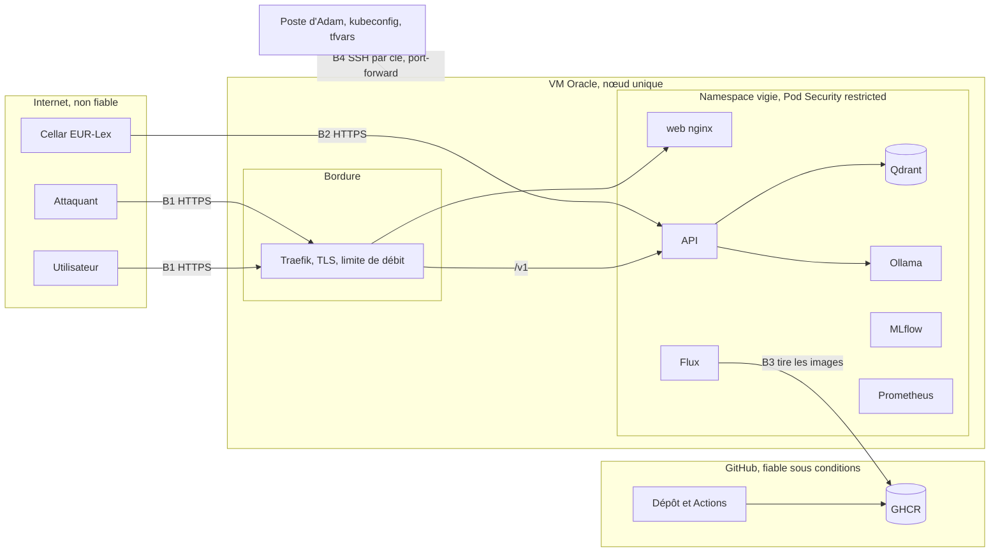

# Modèle de menace

Ce document applique la méthode STRIDE à chaque flux de Vigie. Pour chaque menace, il
donne la mesure prévue et la **preuve** qui montrera qu'elle fonctionne. Une mesure sans
preuve ne compte pas.

Il complète `docs/risk-map.md`, centré sur les risques propres aux LLM, et sera mis à jour
aux jalons J13 (Kubernetes), J14 (infrastructure) et J15 (CI/CD), puis validé par Adam
avant tout passage en public. État au 2 octobre 2026 : toutes les mesures sont
**prévues**, aucune n'est encore prouvée.

## Actifs

| Id | Actif | Pourquoi il compte |
|---|---|---|
| A1 | Jetons d'accès des utilisateurs et jeton administrateur | ils ouvrent l'API et le quota d'un utilisateur, ou l'administration entière |
| A2 | Journal d'audit (texte des questions, sources, décisions) | seul endroit où le texte des questions est conservé, peut contenir une donnée personnelle saisie par erreur |
| A3 | Base d'usage (SQLite) | compteur par utilisateur, sert au quota et au suivi demandé par la grille |
| A4 | Intégrité du corpus et de l'index Qdrant | une réponse fiable suppose un texte d'article exact |
| A5 | Prompt système et seuils des garde-fous | les connaître facilite le contournement |
| A6 | Disponibilité du service sur une VM de 2 OCPU | un seul nœud, sans redondance |
| A7 | Accès à l'infrastructure : clé SSH, clé d'API Oracle, kubeconfig, état Terraform | leur fuite donne le contrôle de la VM ou du compte cloud |
| A8 | Chaîne de livraison : images GHCR, bundle MLflow, dépôt Git | une image ou un bundle altéré passe en production sans attaque directe |

## Frontières de confiance

- **B1, Internet vers la bordure.** Tout ce qui arrive est hostile jusqu'à preuve du
  contraire : jeton vérifié, corps limité, question normalisée puis filtrée.
- **B2, Cellar vers l'ingestion.** Le texte réglementaire est public mais non maîtrisé ;
  il est vérifié par empreinte avant d'entrer dans l'index.
- **B3, GitHub vers le cluster.** Le cluster tire les images ; GitHub ne détient aucun
  accès au cluster.
- **B4, poste d'administration vers la VM.** SSH par clé depuis une seule IP, MLflow et
  Prometheus par `port-forward` seulement.
- **Interne au namespace.** NetworkPolicy en refus par défaut : un pod compromis ne parle
  qu'aux voisins explicitement autorisés.

## Attaquants

| Id | Attaquant | Capacités supposées | Objectif probable |
|---|---|---|---|
| T1 | Anonyme sur Internet | envoie des requêtes HTTP, scanne les ports | trouver un service exposé, saturer la VM |
| T2 | Utilisateur légitime curieux ou malveillant | détient un jeton `user` valide | contourner les garde-fous, extraire le prompt, dépasser son quota |
| T3 | Source de données compromise | modifie un document servi par Cellar ou intercepte le téléchargement | faire citer un texte faux, injecter une consigne indirecte |
| T4 | Attaquant de la chaîne d'approvisionnement | publie une dépendance, une action ou une image piégée | exécuter du code dans la CI ou en production |
| T5 | Personne ayant accès à un secret fuité | possède un jeton, une clé SSH ou une clé Oracle trouvée dans un historique ou une capture | prendre le contrôle de l'API, de la VM ou du compte |

## STRIDE par flux

Légende STRIDE : **S** usurpation, **T** altération, **R** répudiation, **I** divulgation,
**D** déni de service, **E** élévation de privilège.

### F1. Utilisateur vers API (`POST /v1/ask`, `/v1/usage/me`)

| Id | STRIDE | Menace | Mesure | Preuve attendue | Jalon |
|---|---|---|---|---|---|
| F1.1 | S | requête sans jeton ou avec un jeton deviné | jeton `vig_` de 32 octets aléatoires, haché en SHA-256, comparé par `hmac.compare_digest` | test : 401 sans jeton, avec jeton inconnu, expiré ou révoqué | J5 |
| F1.2 | E | jeton `user` sur une route d'administration | portée `user` ou `admin` vérifiée par route | test : 403 sur `/v1/admin/*` avec un jeton `user` | J5 |
| F1.3 | T | injection de prompt directe ou jailbreak | normalisation NFKC, retrait des caractères invisibles, garde-fou d'entrée retenu par le benchmark | rappel au moins 0,90 sur le jeu `test`, red teaming en CI sous 5 % d'attaques réussies | J4, J10 |
| F1.4 | I | fuite du prompt système ou d'une donnée d'un autre utilisateur | catégorie `prompt_leak`, garde-fou de sortie, chaque question traitée seule sans historique serveur | attaques `prompt_leak` du red teaming bloquées | J4, J10 |
| F1.5 | D | inondation de requêtes ou questions géantes | limite de débit Traefik et API, corps à 16 Ko, question à 2 000 caractères, quota quotidien par jeton | tests 413, 422 et 429 avec `Retry-After`, rapport Locust | J5, J11 |
| F1.6 | R | un utilisateur conteste avoir posé une question | journal d'audit chaîné par hash, `trace_id` renvoyé à l'interface | test : une ligne modifiée casse la chaîne | J5 |
| F1.7 | I | interception du jeton en transit | TLS obligatoire, HSTS, redirection 308, même origine pour interface et API | en-têtes vérifiés par `curl -I` sur la production | J13 |

### F2. Interface vers navigateur (rendu de la réponse)

| Id | STRIDE | Menace | Mesure | Preuve attendue | Jalon |
|---|---|---|---|---|---|
| F2.1 | T | réponse du LLM contenant du HTML ou un script | rendu en `textContent`, CSP stricte avec Trusted Types | test d'interface avec une réponse piégée, CSP lue sur la production | J6, J16 |
| F2.2 | S | lien de citation détourné vers un site tiers | URL EUR-Lex construites côté serveur, `rel="noopener noreferrer"` | test : aucune URL de citation hors `eur-lex.europa.eu` | J6 |
| F2.3 | I | jeton conservé au-delà de la session | `sessionStorage` par défaut, « Rester connecté » décoché, jeton effacé sur 401 et à la déconnexion | tests Playwright du cycle du jeton | J6 |
| F2.4 | I | réponse authentifiée mise en cache par le service worker | `NetworkOnly` sur `/v1/*`, aucune mise en cache d'une requête avec `Authorization` | test du service worker : aucune entrée `/v1/` en cache | J6 |

### F3. API vers recherche, Qdrant et Ollama

| Id | STRIDE | Menace | Mesure | Preuve attendue | Jalon |
|---|---|---|---|---|---|
| F3.1 | T | injection indirecte depuis un passage récupéré | passages entre délimiteurs présentés comme des données, garde-fou passé sur les chunks à l'indexation, quarantaine | jeu `indirect_injection` d'au moins 30 exemples | J2, J4 |
| F3.2 | T | écriture directe dans Qdrant | clé d'API Qdrant, service jamais exposé, NetworkPolicy | test de connexion refusée depuis un pod non autorisé | J13 |
| F3.3 | D | épuisement du CPU par le LLM | `OLLAMA_NUM_PARALLEL=1`, file bornée, 503 avec `Retry-After`, `num_predict` plafonné | test : file pleine donne 503 | J3, J5 |
| F3.4 | T | citation inventée par le LLM | validation des citations contre le corpus, retrait et mention « référence non vérifiée retirée » | 0 citation inventée sur le jeu `test`, `FAKE_LLM_HALLUCINATE=1` prouve que le filtre agit | J3, J8 |
| F3.5 | E | changement de fournisseur de LLM par la requête | fournisseur fixé par configuration seulement | test : un en-tête ne change pas le fournisseur | J11 |

### F4. Cellar vers ingestion

| Id | STRIDE | Menace | Mesure | Preuve attendue | Jalon |
|---|---|---|---|---|---|
| F4.1 | T | document altéré en transit ou à la source | HTTPS uniquement, `data/corpus.lock` avec SHA-256 et nombre d'articles attendu | test : une empreinte divergente fait échouer l'ingestion | J1 |
| F4.2 | D | Cellar indisponible | échec explicite en CI, repli par corpus JSONL publié en artefact | job CI rouge, jamais ignoré | J1, J15 |

### F5. API vers journaux, audit et base d'usage

| Id | STRIDE | Menace | Mesure | Preuve attendue | Jalon |
|---|---|---|---|---|---|
| F5.1 | I | jeton, en-tête `Authorization` ou texte de question dans les journaux applicatifs | filtre de rédaction | test du filtre sur un enregistrement piégé | J5 |
| F5.2 | I | donnée personnelle conservée dans le journal d'audit | masquage des données évidentes avant écriture, ni IP ni User-Agent, purge à 30 jours y compris des sauvegardes | test du masquage et de la purge | J5 |
| F5.3 | T | modification ou suppression d'une ligne d'audit | chaînage par hash, un fichier par pod | test : la vérification détecte la ligne modifiée | J5 |
| F5.4 | T | compteur d'usage faussé par des écritures concurrentes | SQLite en WAL sur un volume unique | test avec 3 réplicas | J5, J13 |

### F6. Chaîne de livraison (GitHub, GHCR, Flux, MLflow)

| Id | STRIDE | Menace | Mesure | Preuve attendue | Jalon |
|---|---|---|---|---|---|
| F6.1 | T | dépendance ou action piégée | `uv.lock` et `package-lock.json`, actions épinglées par SHA, Dependabot, `permissions: contents: read` | revue du workflow, OpenSSF Scorecard | J15 |
| F6.2 | T | image altérée dans GHCR | images par digest, SBOM CycloneDX, signature cosign sans clé, Trivy bloquant | job CI rouge sur une vulnérabilité HIGH corrigeable volontaire | J15 |
| F6.3 | E | GitHub compromis prend le contrôle du cluster | CD tirée par Flux, port 6443 jamais ouvert, aucun kubeconfig dans GitHub | scan de ports depuis l'extérieur, liste des secrets GitHub | J13, J15 |
| F6.4 | T | version non évaluée promue | enregistrement MLflow seulement après la barrière, analyse canary, `fault_injection` interdit dans `champion` | canary à 0,3 d'erreurs annulé en moins de 5 minutes | J8, J13 |
| F6.5 | I | secret commité | gitleaks en pre-commit et en CI, `gitleaks git` sur tout l'historique avant publication | barrière gitleaks vue rouge sur une branche jetable | J0, J16 |
| F6.6 | R | commit dont l'auteur est contesté | identités explicites, co-auteur du binôme vérifié par un job CI | job rouge sur un commit sans `Co-authored-by` | J15 |

### F7. Administration de la VM et du compte cloud

| Id | STRIDE | Menace | Mesure | Preuve attendue | Jalon |
|---|---|---|---|---|---|
| F7.1 | S | connexion SSH par mot de passe ou en root | `PasswordAuthentication no`, `PermitRootLogin no`, fail2ban, SSH depuis l'IP d'administration seulement | `sshd -T` sur la VM, liste de sécurité Terraform | J14 |
| F7.2 | I | secret dans `user_data` ou dans l'état Terraform commité | aucun secret dans `user_data`, `terraform.tfvars` et `*.tfstate*` ignorés, état sauvegardé hors dépôt | `git check-ignore`, revue du `user_data` | J14 |
| F7.3 | E | pod qui lit les métadonnées de l'instance | sortie vers `169.254.169.254` interdite, `runAsNonRoot`, `readOnlyRootFilesystem`, `capabilities.drop: [ALL]`, pas de jeton de compte de service monté | test de connexion refusée depuis un pod | J13 |
| F7.4 | D | facture surprise ou compte passé en payant | Always Free uniquement, budget d'alerte, aucune carte ajoutée | capture du budget, coût constaté de 0 euro | J14 |
| F7.5 | D | VM reprise par Oracle pour inactivité | charge de fond légère et planifiée | instance toujours active à la soutenance | J14 |

## Risques résiduels

Ces risques restent ouverts après les mesures. Ils doivent être acceptés par écrit par
Adam (décision 15 du brief) avant tout passage en public.

- **Contournement inédit des garde-fous.** Aucun filtre ne bloque toutes les formulations ;
  la mesure est statistique, et chaque contournement trouvé rejoint `data/regression/`.
- **Nœud unique.** Une panne de la VM coupe le service. Le plan de secours est un cluster
  k3d local pour la démonstration, pas une haute disponibilité.
- **Poste d'administration.** Le kubeconfig, la clé SSH et la clé Oracle vivent sur le
  poste d'Adam ; sa compromission donnerait le contrôle complet. Le runbook d'incident
  prévoit la rotation.
- **Qualité juridique.** Une citation exacte n'empêche pas une interprétation fausse. Le
  bandeau « pas un conseil juridique » reste la mesure principale.
